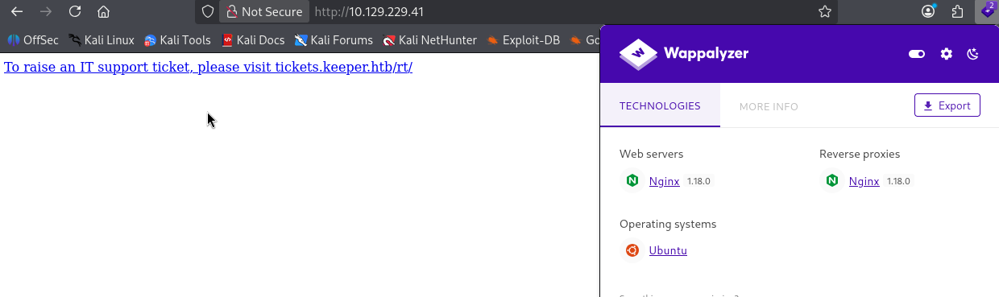
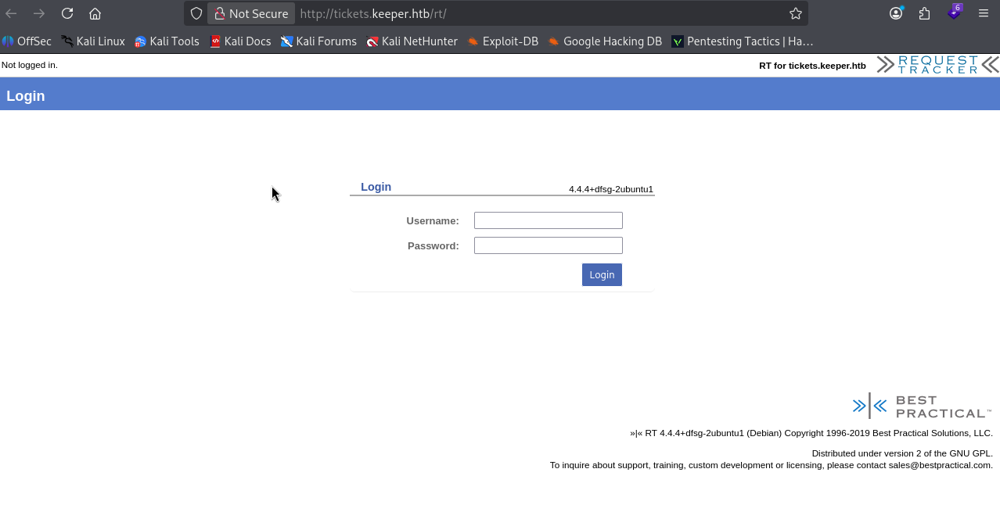
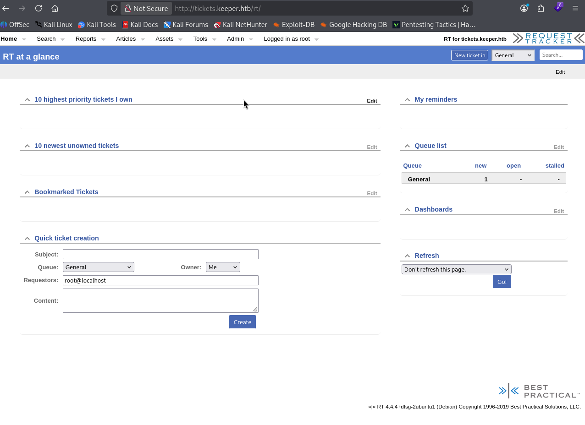
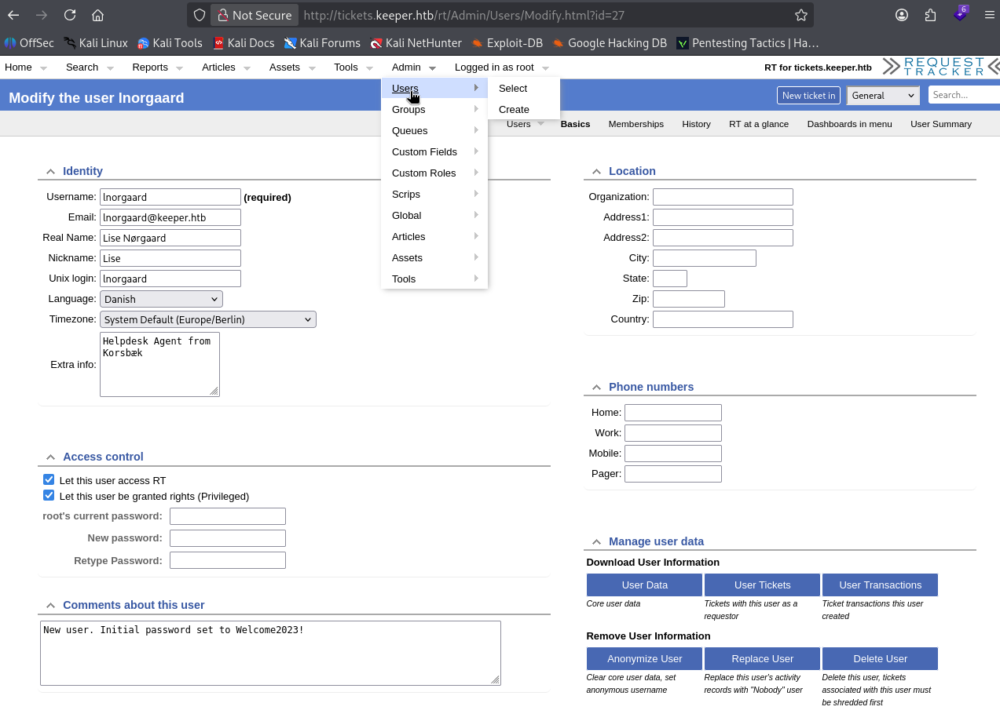
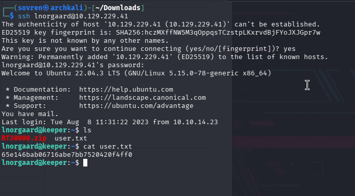
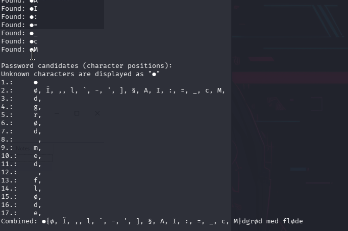
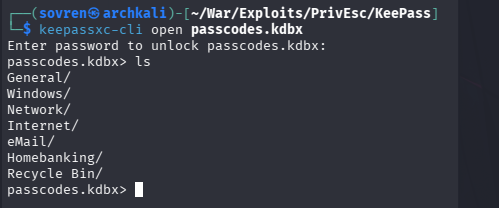
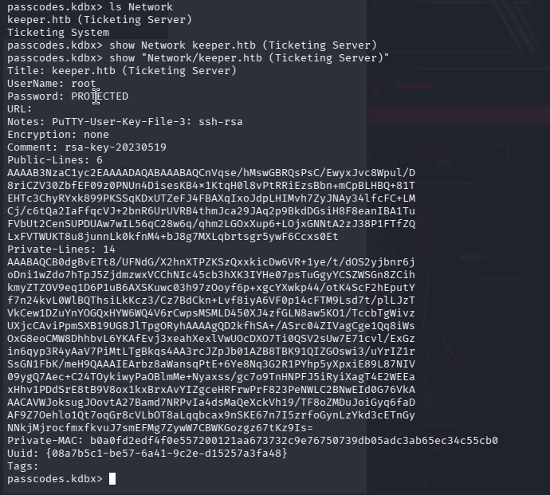
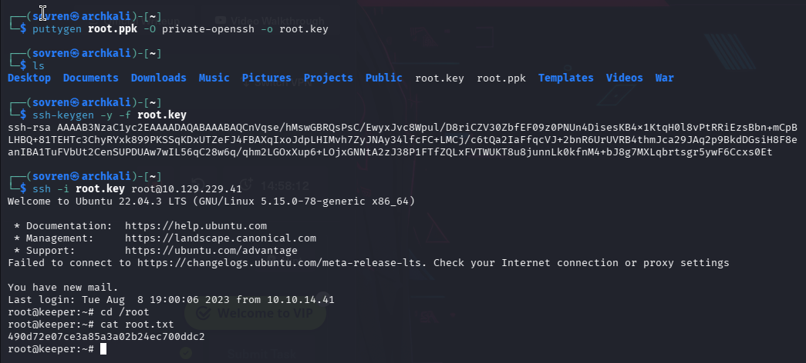

# Walkthrough


## Information Gathering: 

The target ip takes us to the following page: 



The domain was added to the /etc/hosts file and presents a login page. It is discovered in the **Vulnerability Assessment** stage that default credentials to the service are used here.




### Nmap Scans: 

All Port Scan: 
```
PORT   STATE SERVICE
22/tcp open  ssh
80/tcp open  http
```


`-sC -sV` scan: 
```
PORT   STATE SERVICE VERSION
22/tcp open  ssh     OpenSSH 8.9p1 Ubuntu 3ubuntu0.3 (Ubuntu Linux; protocol 2.0)
| ssh-hostkey: 
|   256 35:39:d4:39:40:4b:1f:61:86:dd:7c:37:bb:4b:98:9e (ECDSA)
|_  256 1a:e9:72:be:8b:b1:05:d5:ef:fe:dd:80:d8:ef:c0:66 (ED25519)
80/tcp open  http    nginx 1.18.0 (Ubuntu)
|_http-trane-info: Problem with XML parsing of /evox/about
|_http-server-header: nginx/1.18.0 (Ubuntu)
|_http-title: Login
Service Info: OS: Linux; CPE: cpe:/o:linux:linux_kernel
```


---

## Vulnerability Assessment: 

RequestTracker by Best Practical is an open-source issue tracking system. The target version is **4.4.4**.

Default credentials (`root:password`) were used to access to the admin page allowing an attacker easy access:




The user profile for `lnorgaard` was accessible and credentials were leaked in the Comments section: 



This made it trivial to gain ssh access, as the password listed above is reused to access the target host and discover the user flag: 



---

## Privilege Escalation: 

The `RT30000.zip` file was extracted and contained 2 files: 

`KeePassDumpFull.dmp`
`passcodes.kdbx`

Both files were downloaded onto the attacking machine and a publicly available exploit `keepass_password_dumper.csproj` was run against the `KeePassDumpFull.dmp` file:




AI revealed this to be a Danish phrase:

`rødgrød med fløde`

This was the master password to access the `passcodes.kdbx` file:



`passcodes.kdbx` was then enumerated and revealed a PuTTY key file for root:



The correct section was copied into a file called `root.ppk` and then converted into a usable key that can be invoked to log in via root on the target machine granting full access to the machine and revealing the root flag:




# Summary

The assessment identified a critical attack path resulting in complete compromise of the target system. Initial reconnaissance identified HTTP and SSH services, with the web application running Request Tracker 4.4.4. The application was found to be configured with default administrative credentials, providing unauthorised access to the Request Tracker interface. Further enumeration exposed credentials within the `lnorgaard` user profile, which were subsequently found to be reused for SSH authentication, resulting in access to the underlying Linux host and compromise of the user account. Privilege escalation was achieved through the discovery of an archive containing a KeePass memory dump and database. Analysis of the memory dump recovered the KeePass master password, allowing access to the database, which contained an unencrypted PuTTY private key associated with the root account. The key was converted to a compatible SSH format and used to authenticate directly as root, resulting in full administrative control of the system. The overall compromise was enabled by a combination of default credentials, sensitive credential disclosure, password reuse, insecure handling of backup data, and exposure of an unencrypted privileged SSH private key.