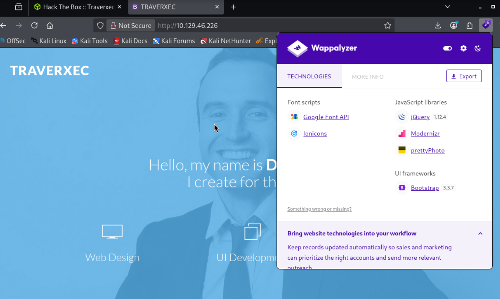
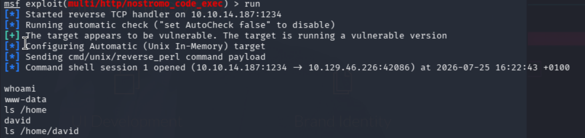
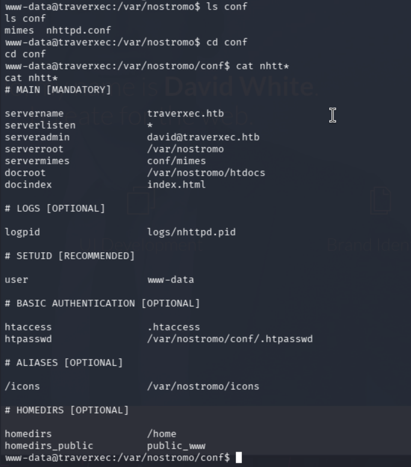
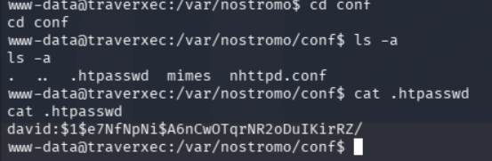
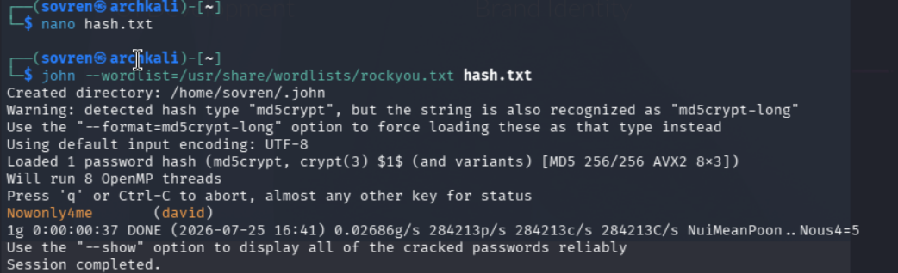
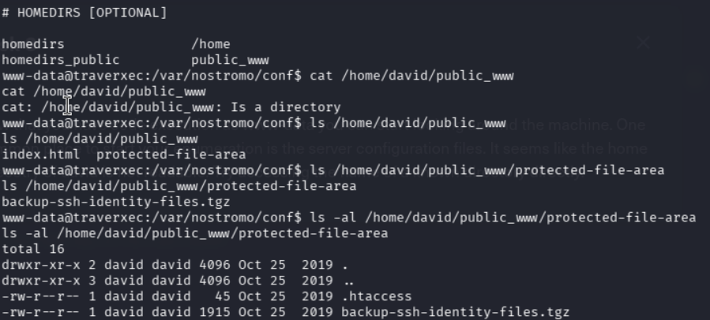
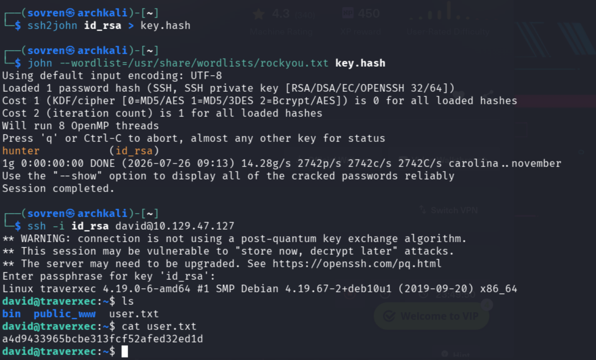
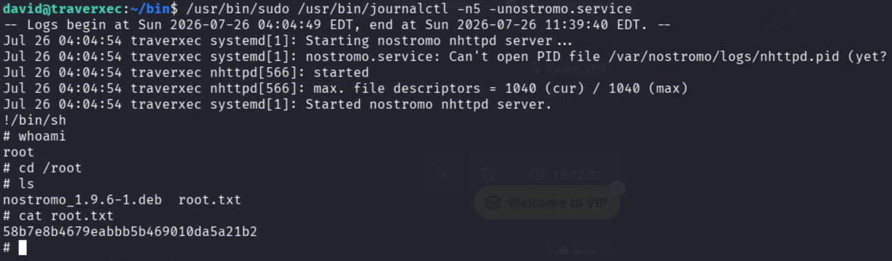

# Walkthrough 


## Information Gathering 

Target ip takes us to the webpage below:




### Nmap Scans


```
PORT   STATE SERVICE VERSION
22/tcp open  ssh     OpenSSH 7.9p1 Debian 10+deb10u1 (protocol 2.0)
| ssh-hostkey: 
|   2048 aa:99:a8:16:68:cd:41:cc:f9:6c:84:01:c7:59:09:5c (RSA)
|   256 93:dd:1a:23:ee:d7:1f:08:6b:58:47:09:73:a3:88:cc (ECDSA)
|_  256 9d:d6:62:1e:7a:fb:8f:56:92:e6:37:f1:10:db:9b:ce (ED25519)
80/tcp open  http    nostromo 1.9.6
|_http-server-header: nostromo 1.9.6
|_http-title: TRAVERXEC
Service Info: OS: Linux; CPE: cpe:/o:linux:linux_kernel
```

Directory enumeration against the target failed across 2 separate attacking VMs, so defences may be in place to protect against this. 


---


## Vulnerability Assessment 

### nostromo 

Nostromo (also known as nhttpd) is a simple, fast, and lightweight open-source HTTP web server. It is designed to use very few system resources by running as a single process and handling network connections efficiently.

Older versions of Nostromo (up to version 1.9.6) contain a critical directory traversal flaw (tracked as CVE-2019-16278). This security bug allows an unauthenticated attacker to send crafted HTTP requests and execute arbitrary system commands via remote code execution (RCE). Because of this, it is frequently featured in cybersecurity training labs and capture-the-flag (CTF) platforms like Hack The Box.

#### CVE-2019-16278

"Directory Traversal in the function http_verify in nostromo nhttpd through 1.9.6 allows an attacker to achieve remote code execution via a crafted HTTP request."  - NIST

Metasploit has a module for exactly this:

```
exploit/multi/http/nostromo_code_exec
```


---

## Exploitation 



Using the Metasploit module mentioned above, initial access to the machine is obtained through the `www-data` user.

Access to the `/home/david` is denied due to permissions. Therefore privilege escalation to `david` is required. 


---

## Privilege Escalation 

### www-data > david:

`/var/nostromo/conf/nhttpd.conf` contains interesting information:



A quick google search revealed the default location of where passwords are stored for Nostromo 1.9.6:



Credentials:
```
david:$1$e7NfNpNi$A6nCwOTqrNR2oDuIKirRZ/
```



The hash was copied into the `hash.txt` file and `john` was used to attempt a password crack against it. This was successful and revealed the credentials:

`Nowonly4me:david` 

However, the credentials discovered were not reused anywhere and provided no opportunities for privilege escalation or lateral movement.

We can use the terminal to bypass the `/home/david` directory by using the information gathered from the Nostromo config file:




The `backup-ssh` file can be moved to the `/tmp` folder of the target machine and then extracted with `tar -xzf`. The private key can then be found in the extracted file and copied to the attacking machine. Password cracking tools can then be used to find the password for the private key:





### Privesc: david > root

The bin directory contains a script that `david` can run. 

```
#!/bin/bash

cat /home/david/bin/server-stats.head
echo "Load: `/usr/bin/uptime`"
echo " "
echo "Open nhttpd sockets: `/usr/bin/ss -H sport = 80 | /usr/bin/wc -l`"
echo "Files in the docroot: `/usr/bin/find /var/nostromo/htdocs/ | /usr/bin/wc -l`"
echo " "
echo "Last 5 journal log lines:"
/usr/bin/sudo /usr/bin/journalctl -n5 -unostromo.service | /usr/bin/cat
```

The script implies that `david` can run the `journalctl` binary as sudo. By removing the pipe and executing only the first portion, the `less` binary is invoked, which presents an opportunity to escalate to a root shell with `!/bin/sh` as seen below:





# Summary 

The assessment identified a vulnerable **Nostromo 1.9.6** web server exposed on port 80, which was susceptible to **CVE-2019-16278**, a directory traversal vulnerability that allows remote code execution. Exploitation using the Metasploit `nostromo_code_exec` module provided initial access as the `www-data` user. Further enumeration of the Nostromo configuration revealed credential information and backup files containing an SSH private key, enabling privilege escalation to the `david` user. Finally, a misconfigured `sudo` permission allowing `journalctl` execution was abused to escape into a root shell via `less`, resulting in full system compromise.